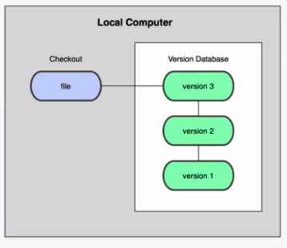
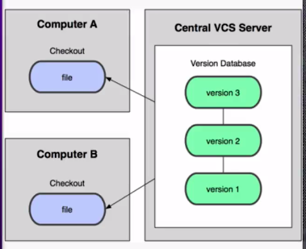
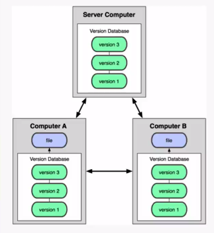
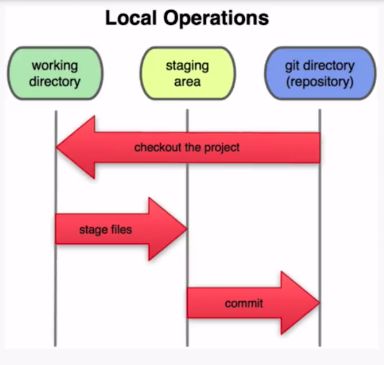
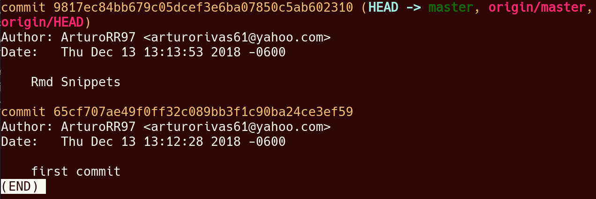
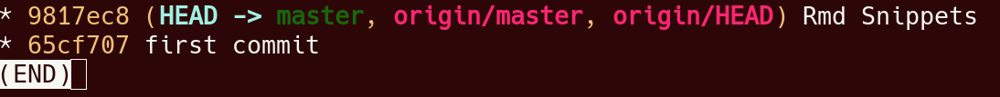
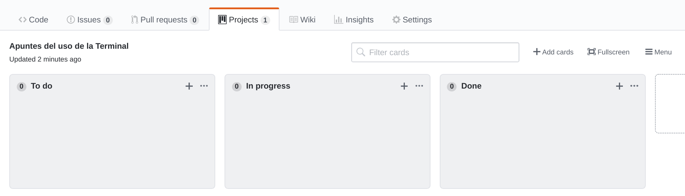

# Introducción
\label{Intro}


## Sistema Control de Versiones
\label{Control de Versiones}

Sistema que registra los cambios realizados sobre un archivo o conjunto de archivos a lo largo del tiempo.

### Clasificación
\label{Clasificación}

#### Locales
\label{Locales}

La información, las versiones, solo existe en una sola computadora.
```{r local, out.width='50%', fig.align='center', fig.cap='Sistema Local', fig.pos='H', echo=FALSE}

```

#### Centralizados
\label{Centralizados}

Los cambios se guardan en un servidor que comparte con todos sus subscriptores los cambios
```{r centralizado, out.width='50%', fig.align='center', fig.cap='Sistema centralizado', fig.pos='H', echo=FALSE}

```

#### Distribuidos (Git)
\label{Distribuidos}

Se guarda una copia del repositorio en la coputadora de cada participante. Que operan de manera independiente y puede mezclarce en cualquier momento.
```{r distribuido, out.width='50%', fig.align='center', fig.cap='Sistema distribuido', fig.pos='H', echo=FALSE}

```
# Git
\label{Git}

### Beneficios de usar Git
\label{Beneficios}

+ Trabajar offline
+ Integridad de los datos

### Estados de Git
\label{Estados}

```{r estados, out.width='50%', fig.align='center', fig.cap='Los 3 estados de Git', fig.pos='H', echo=FALSE}

```

#### Working directory
\label{estado1}

Es el directorio local en donde se guarda la copia del repositorio. Se agregan o se hacen cambios a los archivos de manera local.

#### Staging area
\label{estado2}

Se realiza un add para preparar el archivo para su commit.

#### Git directory (repositorio)
\label{estado3}

Se realiza el commit y se distribuyen los cambios realizados hacia las copias.
 
##### SHA-1
\label{sha-1}

Secure Hash Algorithm, Algoritmo de Hash Seguro, es un conjunto de numeros cifrados que sirven como id de lso commits.

### GitHub
\label{GitHub}

Git y GitHub no son lo mismo.  
Git es el software de control de cambios mientras que GitHub es la plataforma host de los repositorios.   
Aparte GitHub aparte del control de versiones tiene muchas mas herramientas para la organización.

### Manejo de archivos en la terminal
\label{comandos terminal}

+ **cd:** cambiar de directorio.
    - ejemplo: cd Desktop
+ **mkdir:** crear directorio.
    - ejemplo: mkdir apuntes
+ **ls:** lista de archivos.
    - ejemplo: ls
+ **touch:** crear archivo.
    - ejemplo: touch file.txt
+ **rm:** eliminar archivos y directorios.
    - ejemplo: rm file.txt, rm -r apuntes

## Comandos de Git
\label{comandos git}

### Inicializar repositorios
\label{init}

+ git **init** [nombre] : inicializa un repositorio.
+ git **init** : dentro de la carpeta que queremos que sea el repositorio.

### Trabajo en el workplace
\label{status}

+ git **status** : muestra la rama y los cambios sin confirmar.

+ git **add** [archivo o directorio] :** pasar los cambios al estado \hyperref[estado2]{staging}.

+ git **rm `--`cached** [archivo o directorio] : borrar los cambios del git.

+ git **commit** : \hyperref[estado3]{confimar} los cambios a git.
    - **-m** ["mensaje"] : asociar un mensaje para nuestro commit.
    - **`--`amend** : concatenar el commit con el anterior.

### Nombrar Versiones
\label{tag}

+ git **tag** [etiqueta] : etiquetar o nombrar version actual del repositorio.

+ git **tag** [etiqueta] \hyperref[sha-1]{commit} : etiquetar o nombrar versión del commit.
    - **-a** [etiqueta] **-m** : etiquetar con mensaje.
    - **-f** : renombrar la versión.
    - **-d** : eliminar la versión.

### Bitacora de commits
\label{bitacora}

+ git **log** : lista de commits con su respectivo \hyperref[sha-1]{sha-1}, autor, fecha y mensaje. Para salir basta con presionar **q**.
    - **`--`oneline** : infomación reducida a una linea.
    - **`--`graph** : grafico con respecto a las ramas.
    - **-#** : numero de commits que quieres visualizar comenzando desde el ultimo.
    - **> [archivo]** :respalda el log en el archivo.

```{r log, out.width='75%', fig.align='center', fig.cap='imagen de la bitacora', fig.pos='H', echo=FALSE}

```
```{r log-oneline, out.width='75%', fig.align='center', fig.cap='imagen de la bitacora con todas las banderas sin banderas', fig.pos='H', echo=FALSE}

```
### Differencias entre commits
\label{diff}

+ git **diff** [\hyperref[sha-1]{commit}] : permite ver las differencias entre el estado actual y el commit.

+ git **diff** [\hyperref[sha-1]{commit1}] [\hyperref[sha-1]{commit2}]: permite ver las differencias entre los commits que se pasaron como parametros. El orden de los parametros afecta el resultado. Se muestran las acciones que tendrian que pasar para llegar del primer commit al segundo.

### Borrar o reescribir
\label{reset}

+ git **reset** : reescribe la historia del proyecto.
    - **`--`soft** [\hyperref[sha-1]{commit}] : se resetea al commit del sha-1, los commits posteriores a este se borran. Sin borrar archivos y dejando los cambios que ya se habian \hyperref[estado3]{confirmado} en \hyperref[estado2]{staging}.
    
    - **`--`mixed** [\hyperref[sha-1]{commit}] : a diferencia del **`--`soft** descarta completamente los commits regresandolos al estado 1, \hyperref[estado1]{Working directory}. 
    
    - **`--`hard** [\hyperref[sha-1]{commit}] :
    elimina los cambios tando \hyperref[estado3]{confirmados} o en \hyperref[estado2]{staging}. Tambien funciona de manera inversa es decir si se hizo un **reset `--`hard** al inicio del repositorio y luego se hace un **reset `--`hard** al ultimo commit, este se recupera.
    
    - **HEAD** [archivo] : quita de \hyperref[estado2]{staging} al archivo seleccionado.

## Ramas (branches)
\label{branches}

Son las versiones alternas que pude tener nuestro proyecto en git

### Master
\label{master}

Es la rama principal y se genera por defecto.

### Ramas Paralelas
\label{branch}

Es la forma correcta de trabajar en git pues los bugs y las nuevas caracteristicas se programan de manera separada al proyecto pirncipal y uan vez que estan completas se agregan a la rama master.

### Comandos para Ramas
\label{branch command}

+ git **branch** [nombre de la rama] : crea la rama con el nombre dado.
    - **-l** : muestra la lista de ramas del proyecto.
    - **-d** [rama] : borrar la rama si es que no se han realizado commits
    - **-D** [rama] : borrar la rama sin importar nada.
    - **-m** [rama] [nuevo nombre] :  renombrar la rama.

+ git **checkout** [rama|\hyperref[sha-1]{commit}] : navegar entre ramas o commits.
    - **-b** [nombre] : crear y navegar a una nueva rama.
    - **-- [archivo modificado]** : resetea las modificaciones.

+ git **merge** [rama] : se mezcla la rama indicada con la rama en la que estamos ubicados.
    - **`--`allow-unrelated-histories** : esta bandera permite unir 2 lineas del repositorio que no tienen ningun punto en común. 
    - **Fast-forward** : ya que la rama a mezclar sigió la linea temporal de la rama en la que estamos solo se agregaron los cambios sin problemas
    - **Auto-merging** : si ahora la rama a mezclar trabajo de manera paralela a la rama en la que estamos ubicados. por lo que se necesitna mezclar con cierta logica.
        * **Conflictos** : archivos que git no supo con que version quedarse y se deben resolver de manera manual.

+ git **rebase** [rama] : mezcla la rama dada con la rama en la que esta ubicado pero reescribe la bitacora por lo que no pide commits extras y el grafico es lineal. Al reescribir la historia de los commits se pude alterar el trabajo de los demas por lo que es mas peligroso que el merge.

+ git **stash** : se guardan los cambios en staging, sin pasarlos al repositorio, se genera una especie de respaldo.
    - **list** : muestra los estados guadados.
    - **drop** stash@{[#]} : elimina alguno de los estados guardados, que se muestran en la lista.
    - **applay** : aplica el ultimo cambio, es decir el stash@{0}.
    - **apply** stash@{[#]} : aplica el cambio al con el # ingresado, que se consulta en la lista de stash.

+ git cherry-pick [\hyperref[sha-1]{commit}] : importa el commit a la rama en la que esta ubicado, es importante tener el [\hyperref[sha-1]{sha-1}] del commit.

# Git con GitHub
\label{GitHub}

Es una red social para desarrolladores que hostea repositorios.

## Repositorios Remotos
\label{remote}

### Clonando Repositorios
\label{clone}

+ git **clone** [SSH|HTTP] : copia o clona el repositorio de la URL en el directorio en el que te encuentras. Y las modificaciones que realices afectaran al proyecto.

+ **fork** : genera un nuevo repositorio propio, con el contenido del repositorio al que se le hizo el fork.

+ git **remote**
    - **add** [nombre local de referencia] [SSH|HTTP] : Este comando permite hacer la conexión del repositorio local con un repositorio remoto de GitHub. El nombre por convención es origin pero puede ser cualquiera.
    - **-v** : muestra la lista de repositorios remotos enlazados con el repositorio local.
    - **remove** [nombre local de referencia] : elimina el enlace entre el repositorio local y el remoto.

+ git **fetch** [repositorio remoto] [rama] : trae los datos de la rama del repositorio remoto a una nueva rama a la que habra de hacerle merge.

+ git **pull** [repositorio remoto] [rama] : hace un fetch y un merge de manera automática en un solo paso.

+ git **push** [repositorio remoto] [rama] : envia los cambios al repositorio remoto.
    - **`--`tags** : se envian todos las versiones nombradas. 

### LLaves ssh
\label{ssh}

Para evitar tener que meter nuestras contraseñas para cada commit se genera una clave ssh, con el siguiente commando:

+ **ssh-keygen -t rsa -b 4096 -C ["correo"]**

Se guardara la clave en un archivo en la carpeta .ssh y hay que copiar su contenido. Luego en la configuración de GitHub en el apartado de llaves SSH registramos nueva llave ,la nombramos y pegamos el contenido del archivo generad, finalizamos y listo.

# GitHub
\label{GitHub}

## Proyectos (Trello en GitHub)
\label{proyecto}

Los poryectos son por repositorio, y deberia generarce uno por cada caracteristica importante que se quiera producir.

```{r proyectos, out.width='75%', fig.align='center', fig.cap='interfaz de proyectos de GitHub', fig.pos='H', echo=FALSE}

```

En la imagen \hyperref[proyectos]{anterior} se utilizó la plantilla de kanban básico. Los proyectos funcionan mediante tareas, a las que llaman cards.

## Issues
\label{issues}

El área de Issues es para reportar errores o suggerencias. Cuando se trata de errores tmabien se busca saber las condiciones en las que ocurrio el error y si se puede replicar.

Para etablecer la plantilla para Issues, se pude generar el archivo **issue_template.md** y lo que se escriba en este markdown aparecera cuando se intente crear un Issue. La ultilidad de tener una plantilla, es que permite tener entradas uniformes y claras, mediante una normativa.

## Pull request
\label{pull request}

El área de pull request existe por los permisos que se pueden configurar y normalmente se protege a la rama master entonces para poder hacer push a la master es necesario generar uns rama y solicitar una pull request.

La plantilla de las pull request, se establece en el archivo **pull_request_template.md**. Este templete se mostrar siempre que alguienr realice una pull request. Las plantillas nos permiten solicitar la información que es realmente importante para nosotros.

Un pull request necesita de un **reviewer**, que es la persona que revisará la solicitud, úede comentar, aprobar o solicitrar cambios. Una vez aprobada la pull request, se habilita la opción de merge.

Las pull request suelen ocurrir cuando un colaborar externo al nucleo del proyecto genera un fork y despues de refinar su copia quiere que sus cambios se mezclen con el original.
## Labels
\label{labels}

Los label nos permiten distinguir mediante una etiqueta las categorias de los Issues.

## Milestones
\label{milestone}

Un milestone nos permite agrupar **Issues y/o Pull Requests**. Ademas se puede agregar una fecha de entrega al milestone.  

## Gitignore
\label{gitignore}

El archivo **.gitignore** nos permite definir los archivos que git debe ignorar, es decir que exista de manera local pero nunca se subira al repositorio.  

**gitignore.io** es una herramienta que nos ayuda para encontrar los archivos que deberiamos ignorar dependiendo del lenguaje en el que estamos trabajando.  

## GitHub Pages
\label{pages}

Esta caracteristica de GitHub nos permite desplegar codigo estático, por ejemplo un .html, es decir nos da un host completamente gratuito.  

Para tener tu propia pagina web solo fataria comprar un dominio, por ejemplo en **cheapname** y configurar el DNS.  

En GitHub, se debe crea el archivo **CNAME** en la rama master, con el dominio como contenido.

En el probedor del dominio, se modifica el DNS y se agregan 2 del tipo **A Record** con las IP's de GitHub que son **192.30.252.153** y **192.30.252.154** y un tercero del tipo **CNAME Record** con el [User].github.io y estara relacionado a tu GitHub, no solo al proyecto sino a tu cuenta de GitHub, cada proyecto sera un subdirectorio de este.