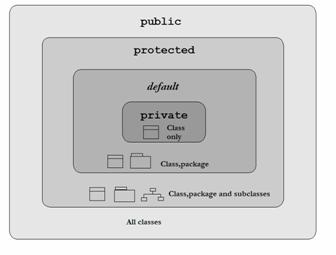

# Introducción {#intro}

## ¿Qué es? {#que}

Java es un lenguaje de programación de **alto nivel**.

Caracteristicas:

+ Simple
+ Orientado a Objetos
+ Distribuido
+ Multihilo
+ Arquitectura Neutral
+ Portable
+ Alto desempeño
+ Seguro

Java es un lenguaje compilado e interpretado.

## Filosofía {#filosofía}

Escribe una vez y correlo donde quieras.

## Origen {#origin}

Surge en 1991 creado por James Goslin, y fue absorvido por la compañia Sun microsystems.

Nacio con el proposito de comunicar dispositivos de forma configurable y portable.

En el 2009 Java llego a su apogeo y se volvio propiedad de Oracle. Nacieron las certificaciones Java.

### Clasificación {#clasificación}

+ Java SE (Standard Edition) : base y sintaxis del lenguaje. 

+ Java EE (Enterprise Edition) : ultima generación.

## Herramientas de desarrollo {#hd}

Para poder trabajar con Java es necesario tener estos 2 componentes:

+ JDK (Java Developer Kit): kit de desarrollo.

+ JRE (Java Run Enviroment): para correr las aplicaciones.

### Maquina Virtual {#mv}

Una vez que tenemos nuestro codigo java y lo compilamos con el comando **javac** se genera una archivo .class que contine ByteCode.

La maquina virtual de Java a la que se llama con el comando **java** recibe de entrada ByteCode y lo interpreta.

## Metodo Main {#main}

Es el punto de entrada de toda aplicación Java. los argumentos que se envian al programa se reciben en el main.

## Entorno de Desarrollo Integrado (IDE) {#ide}

Un entorno de desarrollo integrado es una herraminta que tiene todo lo necessario en una sola aplicación la terminal, editor de texto , buscador de archivos, etc.

# Tipos de Datos {#datos}

Saber que tipo de dato ocupar nos ayuda a evitar el desperdicio de memoria.

## Primitivos {#primitivos}

Se pueden identificar porque se escriben con minúsculas.

### Enteros {#enteros}

+ **byte** (1 byte) -2^7 a 2^7-1.
```java
byte age = 127;
```
+ **short** (2 bytes) -2^15 a 2^15-1.
```java
short year = 2019;
```
+ **int** (4 bytes) -2^32 a 2^32-1.
```java
int id_user = 102301;
```
\newpage

+ **long** (8 bytes) -2^64 a 2^64-1. 
```java
long id_twitter = 123423552532L;
```
Es necesario agregar una **L** al final del dato para señalar que es del tipo long.

### Flotantes {#floatantes}

+ **float** (4 bytes).
```java
float diameter = 34.25f;
```
Se debe añadir una f al final para decirle al compilador que es un float y no un double.

+ **double** (8 bytes).
```java
double price = 1234.256618177892;
```

### Texto {#texto}

+ **char** (2 bytes) unicode.
```java
char gender = 'M';
```
Se deben trabajar entre comillas simples **'**.

### Logicos {#logicos}

+ **boolean** (2 bytes) true or false.
```java
boolean isVisible = true;
```

# Variables {#variables}

Una variable es un espacio de memoria a la que se le asigna un valor.

## Naming {#naming}

+ Sensible a minúsculas y mayúsculas.

+ Su expresión regular seria \^[a-z$\_][\\w$]\*

Las clases se escriben con el estandar **upper camel case** mientras que los metodos y variables con **lower camel case**.

## Cast {#cast}

Es hacer una conversión entre tipos de datos.

De un tipo de dato que ocupa menos memoria a uno con mayor memoria el casteo es automatico.

En el caso opuesto se debe de definir a que tipo de dato se desea castear.

```java
// primer caso
byte b = 6;
short s = b;
// segundo caso
s = 100;
b = (byte) s;
```
Cuando se castea un float a entero este se trunca, es decir desaparece lo que exista después del punto decimal.

En el caso de los char, castear un entero a un char nos regresa el caracter que ese entero represente en el código ASCII.

```{r ascii, out.width='75%', fig.align='center', fig.cap='código ASCII', fig.pos='H', echo=FALSE}
knitr::include_graphics('images/ascii.png')
```

## Arreglos (Arrays) {#arrays}

Un arreglo es un objeto donde se pueden guardar multiples variables de un mismo tipo.

Entonces podemos decir que un arreglo es un contenedor finito de un tipo de variable definido.

Un arreglo de una solo dimensión es una fila, uno de dos dimensiones es una matriz, uno de tres dimensiones es un cubo.

Para poder imaginarnos un array de n-dimensiones lo haremos visualizando a cada array como una matryoshka de n-1 y una caja donde hay varias de estas matryoshka.

```{r arrays, out.width='40%', fig.align='center', fig.cap='matryoshka', fig.pos='H', echo=FALSE}

```

## Declaración e Inicialización

Para declarar un arreglo se utilizan los corchetes "[]", un par por cada dimensión.

+ único arreglo
```java
// solo la variable con los corchetes a su lado
// sera un arreglo del tipo de dato definido.
int arregloInt[] = new int[5], entero = 4;
```
+ múltiples Arreglos
```java
// todas variables son arreglos del tipo de dato definido.
char[][] arreglo1, arreglo2[], arreglon;
arreglo1 = new char[12][2];
// notamos que arreglo2 es un arreglo de arreglos
// de 2 dimensiones eso lo vuelve un arreglo de 3 dimesiones
arreglo2 = new char[3][2][3];
arreglo3 = new char[21][4];
```

## Consultar

Para consultar los elementos de un arreglo se utilizan indices que comienzan en el 0 y van al tamaño del arreglo-1.

```java
// un arreglo de tamaño 2
int[2] arreglo = new int[2];
// inicializariamos sus elementos de la siguiente manera:
// primera posición
arreglo[0] = 5;
// segunda posición
arreglo[1] = 87;
// podemos obtener e imprimir el valor
System.out.println(arreglo[0]);
System.out.println(arreglo[1]);
```

# Operadores {#operadores}

## Aritmeticos {#aritmeticos}

+ **Signo +**
    - suma de 2 numeros.
    ```java
    int a = 3, b = 5;
    int suma = a + b;
    ```
    - concatenación de 2 cadenas.
    ```java
    concatenacion = "Hola" + "mundo";
    ```
+ **Signo -**
    - resta de 2 numeros.
    ```java
    resta = a - b; 
    ```
+ **Signo ´*´**
    - multiplicación de 2 numeros.
    ```java
    multiplicacion = a * b;
    ```
+ **Signo /**
    - división de 2 numeros
    ```java
    division = a / b;
    ```
+ **Signo %**
    - residuo de la división de 2 numeros
    ```java
    modulo2 = a%2;
    ```

## De Asignación {#asignación}

+ **Signo =**
    - asignar un valor o dirección de memoria.
    ```java
    int a = 5;
    int arreglo[] = new int[5]
    ```
+ **Signo +=**
    - acumulador mediante suma.
    ```java
    a += b
    //equivalencia
    a = a + b;
    ```
+ **Signo -=**
    - acumulador mediante resta.
    ```java
    a -= b + c / d;
    //equivalencia
    a = a - (b + c / d);
    ```
+ **Signo *=**
    - acumulador por multiplicación.
    ```java
    a *= b - c * d;
    //equivalencia
    a = a * (b - c * d);
    ```
+ **Signo /=**
    - acumulador por división.
    ```java
    a /= b
    //equivalencia
    a = a / b;
    ```
+ **Signo %=**
    - acumulador por modulo.
    ```java
    a %= b
    //equivalencia
    a = a % b;
    ```

## Incremento y Decremento {#incremento}

### Prefijo {#prefijo}

+ **++**
```java
int i = 0;
// incrementar en 1
++i;
// equivalencia
i = i + 1;
```
+ **--**
```java
int i = 0;
// decrementar en 1
--i;
// equivalencia
i = i - 1;
```
### Posfijo {#prefijo}

+ **++**
```java
int i = 0;
// incrementar en 1
i++;
// equivalencia
i = i + 1;
```
+ **--**
```java
int i = 0;
// decrementar en 1
i--;
// equivalencia
i = i - 1;
```
### Diferencia {#diff}

```java
int i = 3;
System.out.println(i++); // se imprimirá 3 y luego se hará el incremento.
i = 5;
System.out.println(++i); // se hará el incremento primero, por lo que se imprimirá un 6.

```

## Relacionales {#relacionales}

Todo los operadores relacionales se utilizan de manera infija, es decir entre 2 operandos.

+ **==**: igualdad.
+ **!=**: desigualdad.
+ **<**: menor que.
+ **>**: mayor que.
+ **<=**: menor o igual que.
+ **>=**: menor o igual que.

los resultados de estos operadores son de tipo boolean. Cunado se cumplen regresan un **true** y en caso contrario un **false**

## Logicos {#logicos}

Los operadores logicos **&&** y **||** son operadores infijos y nos sirven para trabajar con mas de una condición.

+ **&&** (compuerta AND): solo si ambas condiciones a sus costados son **true**, retorna true.

+ **||** (compuerta OR): mientras haya un **true** en cualquiera de sus extremos el resultado sera **true**.

+ **!** (compuerta NOT): nega la condición que le sigue. es decir si es un **true** retorna un **false** y si es un **false** retorna un **true**.

# Control de Flujo {#flujo}

El flujo se controla a travez de condiciones y bucles.

## If / Else {#ifelse}

```java
if(condicion){
    System.out.println("TRUE");
    if (condicion2){
        instrucciones2;
    }
}
else if(condicion2){
    System.out.println("FALSE");
}
else{
    instrucciones3;
}
```

La estructura **if / else** nos permite tomar decisiones, si la condición es verdares, en este caso se imprimirá "TRUE" y si es falsa se evaluara la condicion2, si esta es verdadera se imprimirá "FALSE". Podemos aplicar esta lógica a cualquier decisión que queramos tomar.

Ademas se pueden anidar ya sea en el if o en el else.

## Switch {#switch}

Nos facilita generar un menú. pues nos evita el tener que escribir multiples \hyperref[ifelse]{if / else}.

```java
int estación = 8;
switch (mes) {
    case 1:
        System.out.println("Primavera");
        break;
    case 2:
        System.out.println("Verano");
        break;
    case 3:
        System.out.println("Otoño");
        break;
    case 4:
        System.out.println("Iniverno");
        break;
    default:
        System.out.println("Solo hay 4 estaciones");
        break;
}
```
## While {#while}

Esta estructura es un bucle que mientras se cumpla la condición se ejecutara el código dentro del while.

```java
int i = 0;
while(i < 5){
    instrucciones;
    i++;
}
```

En el ejemplo de arriba, las instrucciones se repetiran 5 veces. Si fuera una condición que siempre es verdadera este seria un ciclo infinito, en el caso contrario si la condición es falsa desde un principio entonces nunca se ejecutarian las instrucciones dentro del while.


## Do While {#do while}

```java
int i = 0;
do{
    instrucciones;
    i++;
}while(i < 5);
```

Este ciclo es muy similar al \hyperref[while]{while}, pero nos asegura que las instrucciones se ejecuten por lo menos una vez.

## For {#for}

```java
// sintaxis
for(inicialización; condición; paso){
instrucciones;
// ejemplo
for(int i=5; i > 0; i--){
System.out.println("cuenta regresiva:" + i);
}
```
Los ciclos **for** son para evitar tener multiples lineas cuando se tratan de condiciones que se cumplen por el paso del ciclo, mientras que los ciclos \hyperref[while]{while} se utilizan cuando se desconoce cuando se cumplira la condición.

En el ejemplo queda bastante claro cual es la estructura del ciclo **for**, primero va la inicialización que puede o no ser una declaración, la segunda es nuestra condición a evaluar y por ultimo es nuestro paso que podria ser ++, --, de n en n, i/e (logaritmico), etc.

## Foreach {#foreach}

```java
// sintaxis
for(variable : Iterador){
instrucciones;
}
int arreglo[] = {3,5,6,9,5};
for (int i : arreglo){
    System.out.println(i);
}
```
El ciclo foreach lo que nos ofrece es una herramienta para iterar sobre objetos de una manera mas sencilla y eficiente.

# Modificadores de Acceso {#acceso}

```{r modificadores, out.width='75%', fig.align='center', fig.cap='Modificadores de acceso', fig.pos='H', echo=FALSE}

```