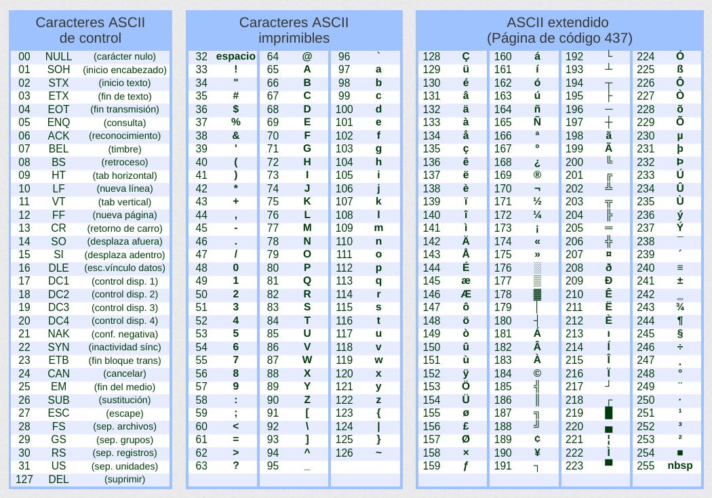

    
# Introducción {#intro}

## ¿Qué es? {#que}

Java es un lenguaje de programación de **alto nivel**.

Caracteristicas:

+ Simple
+ Orientado a Objetos
+ Distribuido
+ Multihilo
+ Arquitectura Neutral
+ Portable
+ Alto desempeño
+ Seguro

Java es un lenguaje compilado e interpretado.

## Filosofía {#filosofía}

Escribe una vez y correlo donde quieras.

## Origen {#origin}

Surge en 1991 creado por James Goslin, y fue absorvido por la compañia Sun microsystems.

Nacio con el proposito de comunicar dispositivos de forma configurable y portable.

En el 2009 Java llego a su apogeo y se volvio propiedad de Oracle. Nacieron las certificaciones Java.

### Clasificación {#clasificación}

+ Java SE (Standard Edition) : base y sintaxis del lenguaje. 

+ Java EE (Enterprise Edition) : ultima generación.

## Herramientas de desarrollo {#hd}

Para poder trabajar con Java es necesario tener estos 2 componentes:

+ JDK (Java Developer Kit): kit de desarrollo.

+ JRE (Java Run Enviroment): para correr las aplicaciones.

### Maquina Virtual {#mv}

Una vez que tenemos nuestro codigo java y lo compilamos con el comando **javac** se genera una archivo .class que contine ByteCode.

La maquina virtual de Java a la que se llama con el comando **java** recibe de entrada ByteCode y lo interpreta.

## Metodo Main {#main}

Es el punto de entrada de toda aplicación Java. los argumentos que se envian al programa se reciben en el main.

## Entorno de Desarrollo Integrado (IDE) {#ide}

Un entorno de desarrollo integrado es una herraminta que tiene todo lo necessario en una sola aplicación la terminal, editor de texto , buscador de archivos, etc.

# Tipos de Datos {#datos}

Saber que tipo de dato ocupar nos ayuda a evitar el desperdicio de memoria.

## Primitivos {#primitivos}

Se pueden identificar porque se escriben con minúsculas.

### Enteros {#enteros}

+ **byte** (1 byte) -2^7 a 2^7-1.
```java
byte age = 127;
```
+ **short** (2 bytes) -2^15 a 2^15-1.
```java
short year = 2019;
```
+ **int** (4 bytes) -2^32 a 2^32-1.
```java
int id_user = 102301;
```
\newpage

+ **long** (8 bytes) -2^64 a 2^64-1. 
```java
long id_twitter = 123423552532L;
```
Es necesario agregar una **L** al final del dato para señalar que es del tipo long.

### Flotantes {#floatantes}

+ **float** (4 bytes).
```java
float diameter = 34.25f;
```
Se debe añadir una f al final para decirle al compilador que es un float y no un double.

+ **double** (8 bytes).
```java
double price = 1234.256618177892;
```

### Texto {#texto}

+ **char** (2 bytes) unicode.
```java
char gender = 'M';
```
Se deben trabajar entre comillas simples **'**.

### Logicos {#logicos}

+ boolean (2 bytes) true or false.
```java
boolean isVisible = true;
```

## Objetos {#objetos}


# Variables {#variables}

Una variable es un espacio de memoria a la que se le asigna un valor.

## Naming {#naming}

+ Sensible a minúsculas y mayúsculas.

+ Su expresión regular seria \^[a-z$\_][\\w$]\*

Las clases se escriben con el estandar **upper camel case** mientras que los metodos y variables con **lower camel case**.

## Cast {#cast}

Es hacer una conversión entre tipos de datos.

De un tipo de dato que ocupa menos memoria a uno con mayor memoria el casteo es automatico.

En el caso opuesto se debe de definir a que tipo de dato se desea castear.

```java
// primer caso
byte b = 6;
short s = b;
// segundo caso
s = 100;
b = (byte) s;
```
Cuando se castea un float a entero este se trunca, es decir desaparece lo que exista después del punto decimal.

En el caso de los char, castear un entero a un char nos regresa el caracter que ese entero represente en el código ASCII.

```{r ascii, out.width='75%', fig.align='center', fig.cap='código ASCII', fig.pos='H', echo=FALSE}

```
