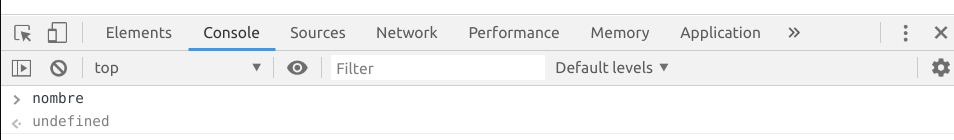
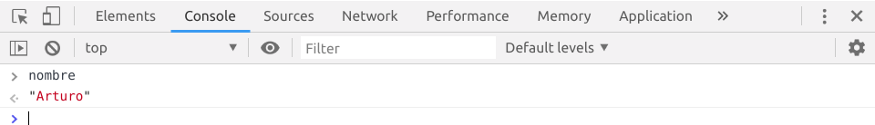

# Variables {#variables}

JavaScript es un lenguaje debilmente tipado, esto nos dice que las variables pueden cambiar de tipo a lo largo del programa.

Podemos declarar un variable con la palabra recervada **var**.

```js
var nombre;
```

Cuando creamos una variable esta se encontrara en el estado de **undefined**.

```{r undefined, out.width='75%', fig.align='center', fig.cap='variable declarada', fig.pos='H', echo=FALSE}

```

Definiendo un valor.

```js
var nombre
nombre = 'Arturo'
```

```{r valor, out.width='75%', fig.align='center', fig.cap='valor de la variable', fig.pos='H', echo=FALSE}

```

## Punto y coma {#semicolon}

En javascript el uso de ";" es opcional.

## String {#string}

A este tipo de variable se le puede aplicar.

+ **toUpperCase()** : a mayusculas
+ **toLowerCase()** : a minusculas
+ **length** : obtener tamaño
+ **charAt(index)** : retorna el caracter en la posición **index**
+ **substr(inicio,fin)** : retorna la subcadena del indce **inicio** al indice **fin**.

### Concatenación {#concat}

Podemos concatenar variables de 2 maneras:

+ Utilizando el simbolo **+**.

```js
var suma = "2 + 2 = " + (2+2)
console.log(suma)
```

+ Mediante interpolación de variables con **`**

```js
var suma = "2 + 2 = "
var resultado = 2+2
var operacion = `${suma} ${resultado}`
console.log(operacion)
```

## Numeros {#numeros}
