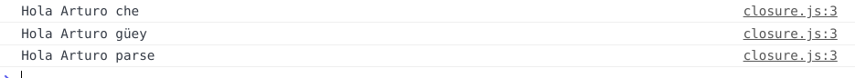

# Variables {#variables}

JavaScript es un lenguaje debilmente tipado, esto nos dice que las variables pueden cambiar de tipo a lo largo del programa.

Podemos declarar un variable con la palabra recervada **var**.

```js
var nombre;
```

Cuando creamos una variable esta se encontrara en el estado de **undefined**.

```{r undefined, out.width='75%', fig.align='center', fig.cap='variable declarada', fig.pos='H', echo=FALSE}
knitr::include_graphics('images/undefined.png')
```

Definiendo un valor.

```js
var nombre
nombre = 'Arturo'
```

```{r valor, out.width='75%', fig.align='center', fig.cap='valor de la variable', fig.pos='H', echo=FALSE}
knitr::include_graphics('images/valor.png')
```

## Constantes {#const}

Son variables inmutables, se declaran con la palabra reservada **const** y por convención se nombrean en mayusculas.

```js
const MAYORIA_DE_EDAD = 18
```
## var vs let vs const {#declaracion}

+ **var** : permite crear variables que tienen un alcance global dentro de la función donde se declaró.
+ **let** : declara variables con alcance es dentro del bloque de codigo donde fueron declaradas.
+ **const** : mismo alcance que let pero son variables inmutables.

## Punto y coma {#semicolon}

En javascript el uso de ";" es opcional.


## String {#string}

A este tipo de variable se le puede aplicar.

+ **toUpperCase()** : a mayusculas
+ **toLowerCase()** : a minusculas
+ **length** : obtener tamaño
+ **charAt(index)** : retorna el caracter en la posición **index**
+ **substr(inicio,fin)** : retorna la subcadena del indce **inicio** al indice **fin**.

### Concatenación {#concat}

Podemos concatenar variables de 2 maneras:

+ Utilizando el simbolo **+**.

```js
var suma = "2 + 2 = " + (2+2)
console.log(suma)
```

+ Mediante interpolación de variables con **`**

```js
var suma = "2 + 2 = "
var resultado = 2+2
var operacion = `${suma} ${resultado}`
console.log(operacion)
```

## Numeros {#numeros}

El objeto **Math** nos ofrece multiples constantes y métodos que se peuden consultar [aqui](https://www.w3schools.com/jsref/jsref_obj_math.asp).

Tambien tenemos formas para castearo de numeros flotantes a cadenas y de cadenas a flotantes.

+ numero**.toFixed(decimales)** : método de un numero float para castearlo a string con la cantidad de decimales definida.

+ **parseFloat(string)** : función que recibe una string y lo vuelve un float.

## Boolean {#boolean}

Los tipos de datos booleanos solo acptan dos valores true o false, pero las funciones que reciben booleanos pueden interpretar el true o el false de distintos tipos de datos.

los valores false son:

+ false
+ null
+ 0
+ ""
+ undefined
+ NaN

Los valores que no estan en esta lista se interpretan como true.

## Funciones {#function}

Las funciones son blockes de código reutilizable. Una función se declara con la palabra reservada function.

```js
function nombreDeLaFunción(param1, param2,...,pramn) {
    //Cuerpo de la función
}
```
Las funciones reciben los parametros por copia(objetos por referencia), evitando asi que haya efectos secundarios.

Las funciones priorizan las variables locales y los parametros sobre las variables globales.

Las funciones pueden recibir como parametros a otras funciones.

```js
class Persona {
    constructor(nombre, apellido, altura) {
        this.nombre = nombre
        this.apellido = apellido
        this.altura = altura
    }
    saludar(fn) {
        var {nombre,apellido} = this
        console.log(`Hola me llamo ${nombre} ${apellido}`)
        if(fn) {
            fn(nombre, apellido, false)
        }
    }
    soyAlto() {
        return this.altura > 1.8
    }
}
class Desarrollador extends Persona {
    constructor(nombre, apellido, altura) {
        super(nombre, apellido, altura)
    }
    saludar(fn) {
        var {nombre,apellido} = this
        console.log(`Hola me llamo ${nombre} ${apellido} y soy desarrolador`)
        if(fn) {
            fn(nombre, apellido, true)
        }
    }
}

function responder(nombre, apellido, dev) {
    console.log(`Buenos dias ${nombre} ${apellido}`)
    if(dev){
        console.log(`No sabia que eras desarrollador`);
        
    }
}

var army = new Persona('Armando','Rivas',1.85)
var arturo = new Desarrollador('Arturo','Rivas',175)

army.saludar(responder)
arturo.saludar(responder)
```

En el ejemplo anterior se utilizan \hyperref[clases]{clases} que se explicarán mas adelante. Pero podemos observar como la función saludar tanto en Persona como en desarrollador resive a la función fn y dependiendo si existe es decir que sea distinta de null, la ejecuta.

#### Parametros {#parametros}

Los parametros de una función se deben de pasar en el orden en el que fueron escritos.

A los parametros se le puede asignar un valor por defecto

```js
function saludar (saludo = 'Hola', nombre) {
    console.log(`${saludo}, soy ${nombre}`)
}

saludar(undefined,'Arturo')// Hola, soy Arturo
saludar('Que onda','Armando')// Que onda?, soy Armando
```

### Arrow fuction (Lambda) {#arrow}

En js se puede asignar funciones a una variables y se les conoce como funciones anonimas.

```js
var mayorDeEdad = function (perosna) {
    return persona.edad >= MAYORIA_DE_EDAD
}
```

se pueden escribir de la siguiente manera:

```js
var mayorDeEdad = ({edad}) => edad >= MAYORIA_DE_EDAD
```

Si la función lo unico que contiene es el return se puede omitir junto a las llaves y lo realiza de manera implicita.

## Objetos {#objetos}

Un objeto se compone de atributos que son pares de clave:valor separados por comas.

```js
var persona = {
    nombre: 'Arturo',
    apellido: 'Rivas',
    edad: 21
}
// se pueden consultar los artributos de un objeto utilizando "."
console.log(persona.nombre)
```
Los objetos pueden definirse como parametros de una función. Y tambien se puede descomponer el objeto y solo especificar el atributo de interes.

Retomando el objeto persona.

```js
function imprimirNombreEnMayusculas({ nombre }) {
    console.log(nombre.toUpperCase())
}
```

### destructuración {#objdes}

Es una técnica o forma de extraer los datos de un objeto.

```js
function imprimirPersona(persona) {
    var {nombre} = persona// nombre = persona.nombre
    console.log(nombre)
}
```

### copia {#copia}

Se puede generar un nuevo objeto apartir de uno ya existente

```js
function cumpleanos(persona) {
    return {
        ...persona,//copia todos los atributos de persona.
        edad = pesona.edad + 1,//modificamos el atributo edad
        ciudad = 'Mexico'// agregar un nuevo atributo
    }
}
```

## Primitivos {#Primitivos}

Existen cinco tipos de datos que son primitivos:

+ Boolean
+ Null
+ Undefined
+ Number
+ String

## Fechas {#dates}

La fechas se manejan con el objeto **Date**.

```js
// El constructor por defecto retorna el dia de hoy
hoy = new Date()
// noche buena de 1990, enero es el mes 0
nocheBuena1990 = new Date(1990,11,24)
```
Las resta puende sumerse y restarse, el resultado devuelto se encontrará en milisegundos

## Comparación {#comparacion}

Para comparar datos primitivos js tiene 2 operadores:

+ **==** : convirte ambas variables al mismo tipo de datos para poderlo comparar. Negación **!=**.

    ```js
    var x = 4, y = '4'
    console.log(x==y)// true
    ```
+ **===** : igualdad estricta,no compara los tipos de variables distintos. Negación **!==**.

    ```js
    var x = 4, y = '4'
    console.log(x===y)// false
    ```

### Condicionales {#con}

+ **>** : mayor que.
+ **>=** : mayor o igual que.
+ **<** : menor que.
+ **<=** : menor o igual que.

# Estructuras de Control {#control}

## Condicional {#if}

La estructura **if** funciona utilizando booleans si la condición es **true** se ejecuta el código dentor de este. Y si la condición fue false se ejecuta el código del **else**.

```js
if(condicion){
    // si la condición se cumple
} else {
    // en otro caso
}
```

## Estructuras Repetitivas {#loops}

### For {#for}

El ciclo for esta compuesto por 3 partes:

+ **contador** : variable a evaluar
+ **condición** : condición limitadora
+ **pas** : modificación del contador.

```js
// for( contador ; condición ; paso)
for(var i = 0; i<limite ; i++) {
    //codigo que se repetira hasta que i sea igual al limite
}
```

### While {#while}

El ciclo while es mas simple que el ciclo for solo se necesita de una condición.

```js
//while(condición)
while(i==5){
    //código que se repetira mientras i sea igual a 5
}
```

Se utiliza while cuando se desconoce el numero de veces que se desea iterar.

Un ciclo while se puede repetir infinitas veces, n veces o ninguna vez. Dependiendo de la condición si es siempre true, si es true en n iteraciones o si nunca fue true respectivamente.

### Do While {#dowhile}

El ciclo due while nos garantiza que el cóndigo dentro de el se ejecutará al menos una vez

```js
do {
    // código que se ejecutará una vez y se repetira mientras se cumpla la condición
} while(estaVacio())
//while(condición)
```

### Switch  {#switch}

Switch nos permite generar de una manera más dinámica un menú, en lugar de un montón de ifs que dependen de la misma variable.

```js
//prompt('mensaje a desplegar al preguntar')
prompt('¿Cual es tu signo?')
switch(signo) {
    case 'acuario':
        // horoscopo de acuario
        break
    case 'piscis':
        // horoscopo de piscis
        break
    case 'geminis':
    case 'géminis':
        // horoscopo de geminis o géminis
        break
    //.
    //.
    //.
    case 'capricornio':
        // horoscopo de capricornio
        break
    default:
        // si el signo ingresado no coincide con los programados
        console.log('no es un signo zodiacal valido')
        break
}
```
El código de cada caso se ejecuta hasta encontrar un break. Esto nos permite hacer que haya multiples casos que ejecutan el msimo código.

# Arreglos {#arrays}

Los arrays son estructuras que nos permiten organizar elementos dentro de una collección. Estos elementos pueden ser números, strings, booleanos, objetos, etc.

```js
var hola = [4,'hola mundo',{nombe:'Arturo', apellido:'Rivas', edad:21}]
```
Los arrays se declaran entre "[" y "]", pueden agrupar cualquier tipo de variable y a diferencia de otros lenguajes multiples tipos de varibles a la vez.

La consulta de un array es atraves de sus indices y estos inican en 0.

Los arreglos tambien se pueden generar utilizando el constructor **Array**

```js
var arreglo = new Array(10).fill(0)
```
En el ejemplo creamo un arreglo con 10 elementos y despues lo rellenamos de 0.

## Filtrar (filter) {#filter}

Es una función que nos permite obtener los elemntos de un arreglo que cumplen con una condición.

```js
// del arreglo hola obtenemos sus elementos que son del tipo number
var holaNumeros = hola.filter(h=>typeof(h)=='number')
```

## Transformar (map) {#map}

Es una función que nos permite aplicar una función a cada elemento del arreglo.

```js
var numeros = [3,15,7,11]
var numerosCuadrados = numeros.map(n=>n**2)
```

## Reducir (reduce) {#reduce}

Es una función que regresa un único valor utilizando todos los elementos del arreglo

```js
var numeros = [3,15,7,11]
// reduce(function, valor inicial)
var suma = numeros.reduce((acc,n)=>acc+=n)// valor inicial igual a 0 por defult
```

Esta función es similar al fold en haskell utiliza una función con acumulador para poder reducir el array a un único valor.

# Prototipos (Clases) {#clases)

Un prototipo es una función, que seria el método contructor de objetos.

```js
// clase Persona, prototipo
funtion Persona(nombre, apellido){
    // atributos
    this.nombre = nombre
    this.apellido = apellido
    // método
    // En esta arrow funtion el objeto que la rodea es Persona por lo que si hace referencia a lo que necesitabamos
    this.saludar = () => console.log(`Hola, me llamo ${this.nombre} ${this.apellido}`)
}
// modificación al prototipo
Persona.prototype.soyAlto = function() {
    return this.altura > 1.7
}
// En una arrow function this no representa al objeto Persona sino al this que lo envuelve en este caso seria window que es el objeto global.
// Persona.prototype.soyAlto = () => this.altura > 1.7
// instancia arturo de Persona
var arturo = new Persona('Arturo','Rivas',1.75)
arturo.saludar()
console.log(arturo.soyAlto())
// instancia alin de Persona
var alin = new Persona('Alin','Carbajal',1.7)
alin.saludar()
console.log(alin.soyAlto())
```

## Herencia Prototipal {#prototipos}

En las versiones anteriores de js la herencia entre prototipo no era soportada porque no existian las clases por lo que se utilizaba la herencia prototipal que se basa en generar un prototipo atraves del prototipo de otro objeto.

## Clases {#clases}

Las clases se siguen siendo **prototipos** pero nos facilitan el trabajo.

```js
class Persona {
    constructor(nombre, apellido, altura) {
        this.nombre = nombre
        this.apellido = apellido
        this.altura = altura
    }
    saludar() {
        console.log(`Hola me llamo ${this.nombre} ${this.apellido}`)
    }
    soyAlto() {
        return this.altura > 1.8
    }
}
```
### Herencia en clases {#herencia}

Las clases ya soportan herencia.

```js
class Desarrollador extends Persona {
    // hereda tanto como atributos como métodos
    constructor(nombre, apellido, altura) {
        super(nombre, apellido, altura)
    }
    // sobreescribimos el método saludar
    saludar() {
        console.log(`Hola me llamo ${this.nombre} ${this.apellido} y soy desarrolador`)
    }
}
```

# Asincronismo {#asincronismo}

## Event Loop {#eventloop}

JavaScript solo puede ejecutar una tarea a la vez, pero puede delegar la ejecución de ciertas tareas.

Las llamadas a función se van colocando en una pila, **callstack**, según el orden de ejecución de nuestro programa. Si una función llama a otra entonces esta se agrega a la lista, cuando se termina la ejecución de una función es desechada.

Una **callback** es una llamada a función que ocurre cuando cierta respuesta o datos estan disponibles, las callbacks la continuación de una tarea delegada. Y cada tarea delegada una vez se haya concluido acaban en la cola de tareas, que se ejecutan solo cuando la pila de ejecución o callstack  esta vacía.

## Operaciones Asincronas {#tiempo}

Las operaciones que se realizan de manera asincoran

+ modificar el DOM
+ funciones a futuro
+ alerts
+ request externos

por ejemplo:

```js
console.log('a')
console.log('b')
console.log('c')
```

Este codigo se ejecuta de manera sincrona una instrucción tras otra. imprimiendo

```js
a
b
c
```

En cambio si agregamos un delay:

```js
console.log('a')
//setTimeout(función, delay ms)
setTimeout(()=>console.log('b'),2000)
console.log('c')
```
**setTimeout** le indica al navegador que se ejecute la función que la ejecutará en un determinado tiempo en el tiempo especificado.

```js
a
c
// 2 segundo despues
b
```
Pero que pasa si el retraso es de 0 ms.

```js
console.log('a')
//setTimeout(función, delay ms)
setTimeout(()=>console.log('b'),0)
console.log('c')
```
Al ser delegada la ejecución de la función al navegador esta se agrega a la cola de tareas por lo que sera ejecutada hasta que la callstack este vacía.

```js
a
c
// 2 segundo despues
b
```
Esto nos enseña que el tiempo especificado no es el tiempo en el que se ejecutará la tarea sino apartir de que tiempo puede ejecutarse.

Un ejemplo que deja muy claro cuando se ejecutaran las tareas en la cola de tareas es el siguiente:

```js
setTimeout(()=>console.log('d'),2000)
//simulamos una ejecución extensa
for(var i = 0; i < 10000000;i++){}
```
la letra d no sera impresa hasta que el código principal concluya en este caso el ciclo for.

## Callbacks {#callback}

Un callback es una función que se envia como argumento a otra función que la invocará en un determinado tiempo.

Ejemplo:

Utilizando JQuery para AJAX

```js
// dentro del html agregar este bloque antes de llamar a nuestro archivo .js
<script
    src="https://code.jquery.com/jquery-3.3.1.min.js"
    integrity="sha256-FgpCb/KJQlLNfOu91ta32o/NMZxltwRo8QtmkMRdAu8="
    crossorigin="anonymous"></script>
```

```js
// hacemos uso de una api de información de starwars
// a que dominio haremos las peticiones
const URL_API = 'https://swapi.co/api/'
// función que queremos ejecutar si fue exitosa
const onResponse = function(character) {
    console.log(`Hola yo soy ${character.name}`)
}
// Para solicitar la información de luke
const luke = `${URL_API}people/1`
// Decirle a javascript que el requet es para un dominio externo
const opts = { crossDomain: true }
// request con el método get
// $.get(url, configuración, callback)
$.get(luke, opts, onResponse)
```

Cunado hablamos de asicronismo no podemos suponer nada del tiempo ni del orden.

Por ejemplo

```js
const URL_API = 'https://swapi.co/api/people/'
const onResponse = function(character) {
    console.log(`Hola yo soy ${character.name}`)
}
// var luke = `${URL_API}people/1`
var opts = { crossDomain: true }

function obtenerPersonaje(id) {
    const url = `${URL_API}${id}`
    $.get(url, opts, onResponse)
}

obtenerPersonaje(1)// info de luke
obtenerPersonaje(2)// info de C-3P0
obtenerPersonaje(3)// info de R2-D2
```
En el código anterio pensariamos que aparecerian las informaciónes de los personajes en el orden que lo solicitamos. Pero no, en realidad no podemos predecir nada y pueden llegar en cualquier orden.

Para controlar el orden del asincronismo podemos encadenar la ejecución de los callbacks

```js
function obtenerPersonaje(id,callback) {
    const url = `${URL_API}${id}`
    $.get(url, opts, function(character) {
        console.log(`Hola yo soy ${character.name}`)
        if(callback){
            callback()
        }
    })
}
// callback hell
obtenerPersonaje(1, ()=>obtenerPersonaje(2,()=>obtenerPersonaje(3,()=>obtenerPersonaje(4,()=>obtenerPersonaje(5,()=>obtenerPersonaje(6))))))
```
Con este código sacrificamos las solicitudes paralelas pero ganamos orden de llegada.

### Manejo de errores {#errores}

Si reestructuramos el ejemplo anterior:

```js
function obtenerPersonaje(id,callback) {
    const url = `${URL_API}${id}`
    $
    .get(url, opts, callback)
    .fail(()=> console.log(`No se puedo obtener el personaje ${id}`))
}
obtenerPersonaje(1, character => {
    console.log(`Hola yo soy ${character.name}`)
    obtenerPersonaje(2, character => {
        console.log(`Hola yo soy ${character.name}`)
        obtenerPersonaje(3, character => {
            console.log(`Hola yo soy ${character.name}`)
            obtenerPersonaje(4, character => {
                console.log(`Hola yo soy ${character.name}`)
                obtenerPersonaje(5, character => {
                    console.log(`Hola yo soy ${character.name}`)
                })
            })
        })
    })
})
```

Si por alguna razón ocurre un error con la respuesta, se ejecutara la función dentro del método **fail** y no se ejecutaran las callbacks posteriores.

### Promesas {#promises}

Las promesas son valores que aun no conocemos. Es la promesa de que ahí habra un valor cuando una tarea asincrona se cumpla.

Las **promesas** pueden existir en 3 estados:

+ **pending** : promesa inicializada.
+ **fullfilled** : concluida exitosamente.
+ **rejected** : errores.

Si una promesa se encuentra en el estado fullfilled puede regresarse al estado pending para encadenar multiples tareas asincronas.

Para obtener el valor de la promesa depende del estado en el que se encuentre:

+ **.then(val=>...)** : Si está en estado fullfilled.
+ **.catch(err => ...** : Si está en estado rejected.

```js
new Promise((fnResolve, fnRejected) => {
}).then(valor => {
...
}).catch(err => {
...
})
```

Con el uso de promesas es mas sencillo hacer la encadenación de tareas asincronicas.

```js
function obtenerPersonaje(id) {
    // generador de promesas
    return new Promise((resolve,rejected) => {
        const url = `${URL_API}${id}`
        $
        .get(url, opts, data => resolve(data))
        .fail(() => rejected(id)) 
    })
}
// solicitamos al personaje 1
obtenerPersonaje(1)
// si se obtuvo exitosamente el personaje 1
.then( character => {
    console.log(`Hola soy ${character.name}`)
    //solicitamos al personaje 2
    return obtenerPersonaje(2)
})
// si se obtuvo exitosamente el personaje 2
.then( character => {
    console.log(`Hola soy ${character.name}`)
    //solicitamos al personaje 3
    return obtenerPersonaje(3)
})
// si se obtuvo exitosamente el personaje 3
.then( character => {
    console.log(`Hola soy ${character.name}`)
})
//si no se pudo obtener alguno de los personajes
.catch( id => console.log(`Ocurrio un error al obtener el personaje ${id}`)
)
```

### Promesas en paralelo {#paralelo}

El performance de un programa puede aumentar utilizando peticiones paralelas en lugar de seriadas, pero es necesario resolver el inconveniente del orden de llegada de las respuestas.

Esto es posible usando promesas:

```js
// función generadora de promesas
function obtenerPersonaje(id) {
    return new Promise((resolve,rejected) => {
        const url = `${URL_API}${id}`
        $
        .get(url, opts, data => resolve(data))
        .fail(() => rejected(id)) 
    })
}
// personajes que queremos solicitar
var ids = [1,2,3,4,5,6]
// creamos una promesa por cada id
var promesas = ids.map(id => obtenerPersonaje(id))
// el objeto Promise tiene un método all que resive un arreglo de promesas
Promise
.all(promesas)
// con console.table podemos imprimir arreglos de una manera mas estética
.then(characters => console.table(characters))
// si todas la promesas fueron exitosas imprimiremos su respuestas
//.then(characters => characters.map(({name}) => console.log(`Hola soy ${name}`)))
// si falla alguna promesa se mostrar este mensaje
.catch( id => console.log(`Ocurrio un error al obtener el personaje ${id}`))
```
### Async-await {#await}

El uso de **async-await** es considerada la forma mas clara y facil de manejar tareas asincronas.

```js
// la misma función generadora de promesas
function obtenerPersonaje(id) {
    return new Promise((resolve,rejected) => {
        const url = `${URL_API}${id}`
        $
        .get(url, opts, data => resolve(data))
        .fail(() => rejected(id)) 
    })
}
// declaramos una función asincrona
async function obtenerPersonajes() {
    var ids = [1,2,3,4,5,6]
    var promesas = ids.map(id => obtenerPersonaje(id))
    // bloque try-catch
    try {
    //
        // la ejecución de esta función se detiene hasta que todas las promesas hayan concluido
        var personajes = await Promise.all(promesas)
        console.table(personajes)
    } 
    // si ocurre un error
    catch (id) {
        console.log(`Ocurrio un error al obtener el personaje ${id}`)
    }
}

obtenerPersonajes()
```
La palabra reservada **async** nos permite definir a la función como asincrona y así utilizar **await**, esta nueva palabra reservada nos permite esperar por una respuesta asincrona. Las tareas asincronas deben ir dentro de un bloque **try-catch**.

# DOM {#dom}

El modelo objeto documento nos permite modificar o crear elementos del html utilizando JS.

# Recursividad {#recursividad}

La recursividad en javascript funciona similar a la forma que funciona en otros lenguajes. Toda función recursiva necesita de un caso base, criterio en el que se detendra la función.

```js
/* Algoritmo de la división entera
13 / 4

13 - 4 = 9  |    1
09 - 4 = 5  |    1
05 - 4 = 1  |    1
01 - 4 = -3 |_____+
            13/4=3
*/
function divisionEntera(dividendo, divisor) {
    if(dividendo<divisor){
        console.log('base');
        return 0
    }
    console.log('recursividad');
    return 1 + divisionEntera(dividendo-divisor,divisor)

}
```

# Memorización {#memory}

La memorización nos permitira ahora procesamiento al no tener que recalcular ciertas operaciones. Esto se utiliza para la programación dinámica.

```js
/* algoritmo del factorial
    6! = 6 * 5 * 4 * 3 * 2 * 1
    12! = 12 * 11 * 10 * 9 * 8 * 7 * 6!
*/

function factorial(n) {
// si no existe el objeto this.cahe lo creamos
    if(!this.cache) {
        this.cache = {}
    }
    debugger
    // si ya habiamos calculado previamente el factorial de n
    if(this.cache[n]){
        // lo retornamos
        return this.cache[n]
    }
    // si n es 1 o 0 retornamos un 1
    if(n <= 1) {
        return 1
    }
    // en cualquier otro caso  guradamos el resultado en cache[n] y hacemos la llamada recursiva
    this.cache[n] = n * factorial(n-1)
    debugger
    // devolvemos cache[n]
    return this.cache[n]
}
```
# Closures {#closures}

Son funciones que recuerdan los estados de la cosas cuando fueron invocadas.

```js
function crearSaludo(finalDeFrase) {
    return function (nombre) {
        console.log(`Hola ${nombre} ${finalDeFrase}`)
    }
}

const saludoArgentino = crearSaludo('che')
const saludoMexicano = crearSaludo('güey')
const saludoColombiano = crearSaludo('parse')

saludoArgentino('Arturo') // Hola Arturo che
saludoMexicano('Arturo') // Hola Arturo güey
saludoColombiano('Arturo') // Hola Arturo parse
```
```{r closure, out.width='75%', fig.align='center', fig.cap='En esta imagen vemos la salida del código', fig.pos='H', echo=FALSE}

```
En este ejemplo tan sencillo vemos el poder de las closures creamos las funciones apartir de otra función, pero estas mantienen el valor de la variable **finlaDeFrase** de manera independiente.

# Contexto {#contexto}

Hay 3 formas para porder definir a quien se refiere **this**.

+ método function**.bind(contexto, param1, param2,..., paramN)** : genera una nueva función atada a un nuevo this. y se le pueden enviar parametros.
    ```js
    const arturo = {
        nombre: 'Arturo',
        apellido: 'Rivas'
    }

    function saludar() {
        console.log(`Hola, mi nombre es ${this.nombre}`)
    }

    const saludarAArturo = saludar.bind(arturo)
    ```
+ método function**.call(contexto, param1, param2,..., paramN)** : a difenrencia de bind no genera una nueva función sino que la ejecuta.
+ método function**.apply(contexto, [param1, param2,..., paramN])** : es muy similar a call pero los parametros se encuentran dentro de un arreglo.