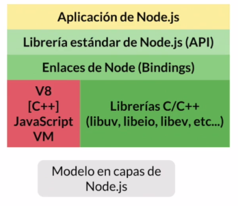

# ¿Qué es Node.js? {#what}

Es un ambiente de ejecución de código de JavaScript. Cambió el paradigma con el que se solía trabajar a JavaScript, pues este estaba aprisionado a los navegadores.

Caracteristicas:

+ Libre
+ Real Time
+ Orientado a eventos
+ Asíncrono
+ Multi-plataforma
+ Server Side
+ Robusto
+ Escalable
+ Expandible
+ No bloqueante

Es un aplicativo que hace uso de librerías ára procesar y ejecutar código JavaScript.

Node.js utiliza el motor de JavaScript de Google Chrome, V8.

```{r arquitectura, out.width='75%', fig.align='center', fig.cap='Modelo de capas de Node.js', fig.pos='H', echo=FALSE}

```

## Event Loop {#eventloop}

Es un ciclo infinito que constantemente toma eventos de la cola y los comunica a otros procesos. Y cuando se genera la respuesta lo retorna al motor de JavaScript.

```{r eventloop, out.width='75%', fig.align='center', fig.cap='Composición del Event loop', fig.pos='H', echo=FALSE}
knitr::include_graphics('images/eventloop.png')
```

**Poll** es el componente mas importante pues es mediante el cual se comunican las librerias de node. 

## Non Real-Time {#nrt}

```{r nonrealtime, out.width='75%', fig.align='center', fig.cap='aplicación que no es de tiempo real', fig.pos='H', echo=FALSE}
knitr::include_graphics('images/nonrealtime.png')
```
Ejemplos:

+ Servidor API 
+ Servidor de Sitio web
+ Servidor de Servicios de red
+ Servidor de Proxy

## Real-Time {#rt}

```{r realtime, out.width='75%', fig.align='center', fig.cap='Comunicación en aplicaciones de tiempo real', fig.pos='H', echo=FALSE}
knitr::include_graphics('images/realtime.png')
```

La comunicación se vuelve bidireccional, haciendo que el canal de comunicación deje de ser efimero y se vuelva persistente.

Ejemplos:

+ Comunicación en tiempo real
+ Monitoreo de datos
+ Juegos en Linea

# Instalación {#install}

Para istalar la version mas reciente de node.js se utilisa **nvm** (node version manager). Y una vez istalado el nvm basta con ejecutar el siguiente comando

```zsh
sudo nvm install --lts
```

Este comando instalara la version mas reciente con soporte a futuro.

# Node Package Manger NPM {#npm}

Es un componente se node que nos permite administrar las dependencias de node, además de inicializar proyectos.

El comando **npm init** nos presentará un formulario para la creación de un nuevo poryeto.
Cuuando se termine de ejecutar el comando se habra creado un archivo package.json que contine la configuración de nuesto proyecto.

Al estar trabajando con npm el archivo package.json se altera constantemente sin que nos demos cuenta.

**npm ls** listara las dependencias de nuestro proyecto.

**npm install [dependencia]** nos permite instalar nuevas dependencias.

**npm uninstall** remueve dependencias.

# Modulos {#modulos}

Un modulo es un conjunto de funciones que se desean reutilizar en otros programas.

## Locales {#localmodules}

El formato para declarar un modulo local es el siguiente.

```js
//hello.js
module.exports = {
    // declaración de un atributo que contiene una función
    sayHello: name => `Hello to ${name}`;
    }
}
```
Para importar un modulo local se hace lo siguiente:

```js
// alias del modulo = ubicación del modulo la extensión solo es necesaria si existe un archivo con el mismo nombre.
const hello = require("./hello.js")
// función declarada en el modulo.
hello.sayHello('Arturo')
```
Si require solo recibe la dirección de un directorio y no de un archivo, este busca dentro de ese directorio un archivo que se llame index con cualquir extensión. 

## Externos {#externmodules}

Una vez que se hayan instalado las dependencias mediante **npm**.

**npm install** nos permite instalar todas las dependencias que esten declaradas en el package.json

El formato para importar modulos externos que ya se instalaron media npm.

```js
const cowsay = require("cowsay")
```

La forma en la que se llaman a las funciones es la misma tanto para los modulos locales como externos.

# Modulos Nativos {#nativos}


## File System {#archivos}

Es el modulo que nos permite manejar los archivos del sistema.

```js
const fs = require("js")
```

### fs.readFile(path[, option], callback) {#fread}
    
Es una función que nos permite leer de manera asíncrona el archivo con la ruta **path** y con larespuesta obtenida ejecutar la función**callback** que tiene la forma: 
    
**(error, data) => {...}**

```js
fs.readFile("./src/ejemplo.txt", "utf8", (err, data)=>{
    if(err) throw err;
    console.log(data)
})
```

El código anterior imprime todo el contenido del archivo ejemplo.txt

### fs.writeFile(path, data[, option], callback) {#fwrite}

Esta función nos permite escribir **data** en el archvivo con la dirección **path** y ejecutar **callback** al terminar la operación.

```js
fs.writeFile("./resources/incNumber.txt", incValues.join("\n"), (err, data) => {
    if(err) throw err;
})
```
## Readline {#readline}
