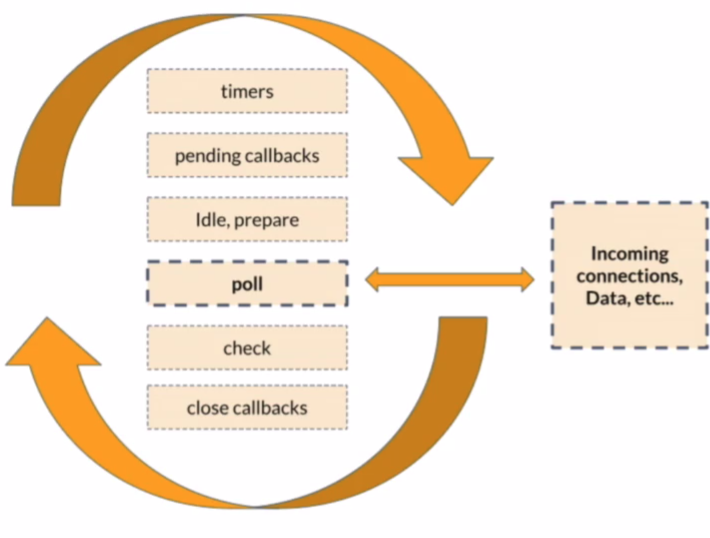
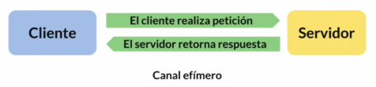
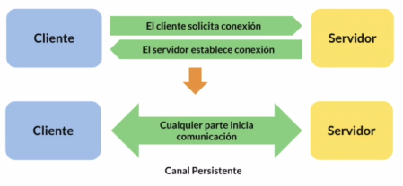

# ¿Qué es Node.js? {#what}

Es un ambiente de ejecución de código de JavaScript. Cambió el paradigma con el que se solía trabajar a JavaScript, pues este estaba aprisionado a los navegadores.

Caracteristicas:

+ Libre
+ Real Time
+ Orientado a eventos
+ Asíncrono
+ Multi-plataforma
+ Server Side
+ Robusto
+ Escalable
+ Expandible
+ No bloqueante

Es un aplicativo que hace uso de librerías ára procesar y ejecutar código JavaScript.

Node.js utiliza el motor de JavaScript de Google Chrome, V8.

```{r estructura, out.width='75%', fig.align='center', fig.cap='Modelo de capas de Node.js', fig.pos='H', echo=FALSE}
knitr::include_graphics('images/estructura.png')
```

## Event Loop {#eventloop}

Es un ciclo infinito que constantemente toma eventos de la cola y los comunica a otros procesos. Y cuando se genera la respuesta lo retorna al motor de JavaScript.

```{r eventloop, out.width='75%', fig.align='center', fig.cap='Composición del Event loop', fig.pos='H', echo=FALSE}

```

**Poll** es el componente mas importante pues es mediante el cual se comunican las librerias de node. 

## Non Real-Time {#nrt}

```{r nonrealtime, out.width='75%', fig.align='center', fig.cap='aplicación que no es de tiempo real', fig.pos='H', echo=FALSE}

```
Ejemplos:

+ Servidor API 
+ Servidor de Sitio web
+ Servidor de Servicios de red
+ Servidor de Proxy

## Real-Time {#rt}

```{r realtime, out.width='75%', fig.align='center', fig.cap='Comunicación en aplicaciones de tiempo real', fig.pos='H', echo=FALSE}

```

La comunicación se vuelve bidireccional, haciendo que el canal de comunicación deje de ser efimero y se vuelva persistente.

Ejemplos:

+ Comunicación en tiempo real
+ Monitoreo de datos
+ Juegos en Linea

# Instalación {#install}

Para istalar la version mas reciente de node.js se utilisa **nvm** (node version manager). Y una vez istalado el nvm basta con ejecutar el siguiente comando

```zsh
sudo nvm install --lts
```

Este comando instalara la version mas reciente con soporte a futuro.
