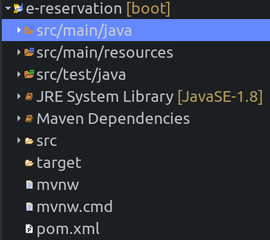
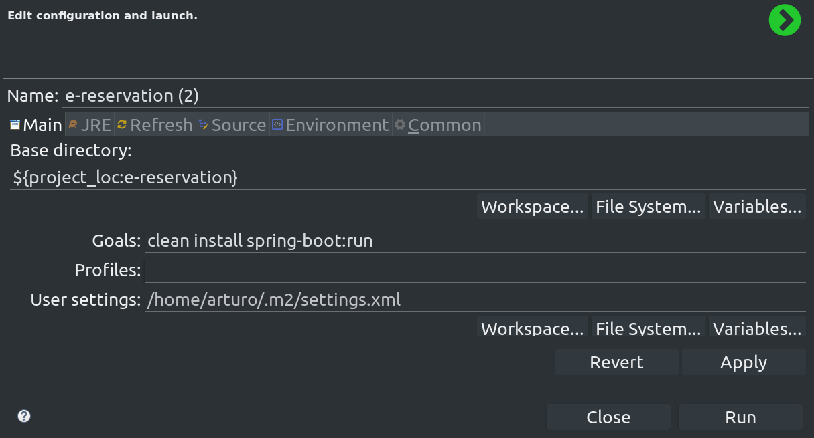
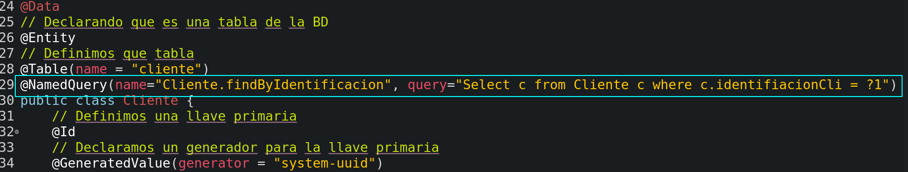
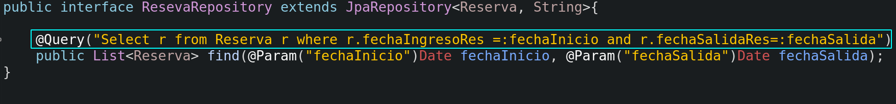
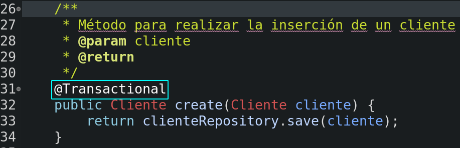
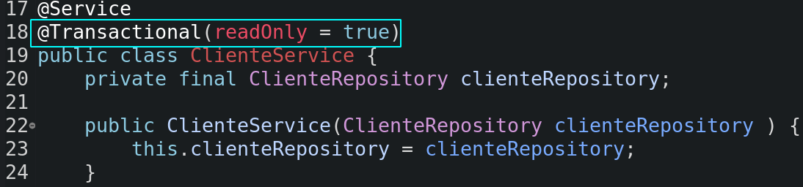

# Aplicación Empresarial {#empresarial}

Es una aplicación conformada por 3 componentes:

+ La empresa.
+ Los requerimientos no funcionales. Intervienen los procesos y las personas.
+ Conjunto de elementos articulados que resuleven un problema.

Se construyen de manera modular, para solventar los problemas del usuario. Y se hace uso de la Interoperabilidad de diversos lenguajes y tecnologias.

Hay dos enfoques para crear aplicaciones empresariales.

+ Aplicaciones hechas a medida, resolver un problema específico.
+ Aplicaciones multitarget.

## Características {#empcara}

+ **Usuario concurrentes** : gran cantidad de usuarios conectados a la vez.
+ **24/7** : Soporte todo el año.
+ **Respaldo y Seguridad de la información**.

# Aplicación Web {#web}

Las aplicaciones web estan compuestas por 3 capas o elementos:

+ El cliente
+ EL servidor
+ La base de datos

## Ventajas {#ventajasweb}

+ Facil Instalación y actualización.
+ Ahorro de recursos en equipos y dispositivos.
+ Compatibilidad multiplataforma.
+ Soporte a multiples usuarios concurrentes.
+ Acceso multidispositivo.

## Arquitectura {#arquitectura}

El proceso para el desarrollo de un Software es similar al de la construcción de una casa. Primero la recolección de requerimientos funcionales, que son las caracteristicas que diferenciaran al Software de otros. Luego seguiría el diseño, que nos permite visualizar el producto final, en forma de prototipos. Y por ultimo la implementación, donde se lleva el diseño a la práctica.

# Servidor Web {#webserver}

Los servidores web tienen un **Contenedor web** que es el que gestiona los servlets, JSP, JSF, etc. Entre los servidores web estan Tomcat, Jetty, GlassFish web y Payara web.

# Servidor de Aplicación {#appserver}

Los servidores de aplicación ademas de tener el **Contenedor web** tienen el **Contenedor negocio** que es el que se encarga de las tecnologías EJB(Enterprise Java Beans).

Algunos servidores de aplicación son JBoss, WhatFly, GlassFish full y Payara full.

# Patrón de Diseño MVC {#MVC}

M.V.C. -> Modelo Vista Controlador, es el standard en la construcción de aplicaciones web.

+ **Modelo** : Todas las clases que se involucran con la BD.
+ **Negocio** : Todas las clases donde se encuentra la lógica y se cumplen los requerimientos funcionales.
+ **Vista** : Todas las clases, archivos relacionados con la Interfaz del Usuario.

Este patrón de diseño nos permite actualizar o cambiar las capas de manera independiente sin afectar a las otras. Facilitando la mantenibilidad.

# Servlets {#servlets}

Son componentes del lado del server, que permiten procesar las peticiones (request) y responder a ellas (response) generando contenido dinámico o redireccionar a otros recursos.

## Tipos {#tiposservlet}

+ **HttpServlet (HTTP)** : Es el mas usado y se encuentra en el paquete javax.servlet.http.
    - Utiliza los métodos GET y POST
+ **GenericServlet (Otros Protocolos)** : son servlets que nos permiten utilizar cualquier protocolo y se encuentra en el paquete javax.servlet
    - Utiliza el método service

Configuaración a traves de anotaciones ya no es necesario hacerlo en XML.

# Java Server Pages (JSP) {#JSP}

Son componenetes, que nos permiten generar el contenido dinámico de una manera mas eficiente, pues nos permite escribir código **Java** dentro del código **HTML** por lo que el HTML es más mantenible pues no es una cadadena.

Se puede diferenciar a un JSP de un HTML tradicional por el uso de **"<%" y "%>"**. Al código entre **"<%" y "%>"** se le conecen como **directivas**.

## Directivas {#directivas}

+ **Especificación** : Indica el lenguaje con el que se trabaja.

    ```html
    <%@ page language="java" contentType="text/html;charset=UTF-8"
        pageEncoding="UTF-8"%>
    ```
+ **Comentarios** : Comentarios en el JSP

    ```html
    <%-- Comentarios --%>
    ```
+ **Inicialización** : inicializar variables

    ```html
    <%! int i = 0; %>
    ```
+ **Scriptless** : Bloques de código

    ```html
    <%
		for (i = 0; i < 10; i++) {
	%>
		<label>Hola <%=i%></label>
	<%
		}
	%>
    ```
+ **Expresión** : concatener una variable en forma de String.

    ```html
    <label>Hola <%=i%></label>
    ```

# Spring Framework {#Spring}

## ¿Qué es? {#what}

Es un Framework Open Source, desarrollado por Rod Johnson 2003. Y nace como una alternativa para manejar el tema del negocio, pues eran muy complejas las tecnologias Java en ese momento en especial los **EJB**. Spring no se limita al desarrollo web.

## Caracteristicas {#sfeatures}

+ **Desarrolo Basado en POJOS** : Permiten representar un concepto en una clase pues solo tiene atributos privados y metodos getters/setters.

+ **Bajo Aclopamiento** : Se minimiza la interdependencia. Permitiendo que cada modulo trabaje de manera independiente.

+ **Programación Declarativa** : en lugar de tener que configurar todo en un XML, se puede configurar con el uso de anotaciones.

+ **Reducción de codigo repetitivo** : Optimiza la generación de los objetos.

+ **Arquitectura en Capas**

+ **Inversion of control** : Es la caracteristica base que se encarga de la inyección de dependencias.

# Spring Boot {#boot}

Para crear un aplicación utilizando Spring Boot se requiere de:

+ JDK
+ Maven
+ independiente

## Creando Aplicación {#crandoapp}

Utilizando el servicio de Spring Initializr podemos generar la estructura de nuetro proyecto de manera rápida y sencilla.

Podemos crearlo desde la página web https://start.spring.io/ o desde el mismo IDE.

Una vez cargado el proyecto en el IDE tendra la siguiente estructura:

```{r estructura, out.width='75%', fig.align='center', fig.cap='Estructura de un proyecto en Spring Boot', fig.pos='H', echo=FALSE}

```
Esta estructura considera el back y el front al igual que las pruebas. Y podemos ver el archivo pom.xml que se encarga de la configuración de Maven.

Para ejecutar el proyecto por primera vez nos pedira una configuración.

```{r config, out.width='75%', fig.align='center', fig.cap='Pantalla de configuración', fig.pos='H', echo=FALSE}

```
### Estructura {#estructura}

Dentro del paquete default del directorio **src/main/java** generaremos la estructura con la que trabajaremos nuestro proyecto.

+ **modelo** : interacción con la base de datos.
+ **vista** : interfaz y REST.
+ **resources** : operaciones CRUD.
+ **services** : interacción con la interfaz.

# Spring Data JPA {#data}

Prove una manera facil de implementar la capa de acceso a datos.

Crea una implementación de repositorios y encapsula todos los detalles de la implementación de JPA.

Soporta paginación, ejecución dinámica de queries.
## Persistencia de Objetos {#opersistencia}

Toda aplicación sin importar la tecnología o plataforma, necesita almacenar su información y poderla recuperar en cualquier momento, a esto se le conoce como persistencia.

### Tecnologías {#ptecno}

+ **JDBC** : Biblioteca java que permite gestionar la información de la base de datos de forma natural utilizando sentencias DML y DDL.
    - **Capas de Persitencia** : ORM mapea un modelo relacional a uno de objetos.
+ **JPA** : Administrador de persistencia con estandares de transaccionalidad, consultas y pool de conexiones.

## Lombok {#lombok}

Es una biblioteca que nos permite optimizar la generación de POJOS.

Mediante el uso de anotaciones podemos generar los metodos getters, setters, constructores, sincronizar metodos, toString, equal, etc.

Podemos consultar estas anotaciones en su documentación en https://projectlombok.org/features/all .

Ejemplo:

```java
import lombok.Data;
@Data
public class Cliente {
	String nombreCliente;
	String apellidoCliente;
	String idCliente;
	String direccionCliente;
	String telefonoCliente;
	String emailCliente;
	
	public void Cliente() {
		
	}
}
```
La anotación **@Data** generará automáticamente los metodos toString, equals, hashCode , getters y setters del POJO.

## Mapeo de Tablas a Clases (ORM) {#orm}

Para realizar el mapeo de una **tabla** a una **clase** se realiza lo siguiente:

+ Las columnas de la tabla se transaforman en atributos de la clase.

+ Las relaciones que tenga la tabla pasan a ser objetos o listas de objetos.

Para realizar el mapeo se hace uso de anotaciones de JPA donde la anotación principal seria **@Entity**, es la anotación que informa que la clase es una tabla de la BD, la anotación **@Table** nos permite definir que tabla de la BD.

Las relaciones entre las tablas se deben declarar de manera bidireccional. Si la relacion es de uno a muchos con respecto de una entidad A a una entidad B, en la clase A se declarará un conjunto de clases B y en la clase B se declarará un objeto de la clase A. Esto se realiza con las anotaciones **@OneToMany** y **@ManyToOne**.

Hay muchas funciones ya automatizadas, una de ellas seria la generación de id mediante un generator. Se usan las anotaciones **@Id**, **@GeneratedValue** y **GenericGerenator**.

Ejemplo:

```java
package com.platzi.ereservation.modelo;

import java.util.Set;

import javax.persistence.Entity;
import javax.persistence.GeneratedValue;
import javax.persistence.Id;
import javax.persistence.OneToMany;
import javax.persistence.Table;

import org.hibernate.annotations.GenericGenerator;

import lombok.Data;

/**
 * Clase para la tabla cliente
 * @author Arturo Rivas
 */
//POJO automático
@Data
// Declarando que es una tabla de la BD
@Entity
// Definimos que tabla
@Table(name = "cliente")
public class Cliente {
    // Definimos una llave primaria
	@Id
    // Declaramos un generador para la llave primaria
	@GeneratedValue(generator = "system-uuid")
    // Definimos como trabajara el generador
	@GenericGenerator(name="system-uuid", strategy="uuid2")
	private String idCli;
	private String nombreCli;
	private String apellidoCli;
	private String direccionCli;
	private String telefonoCli;
	private String emailCli;
    // Declaramos una relación de uno a muchos
	@OneToMany(mappedBy = "cliente")
	private Set<Reserva> reservas;
	public Cliente() {
		
	}
}
```

```java
package com.platzi.ereservation.modelo;

import java.util.Date;

import javax.persistence.Entity;
import javax.persistence.GeneratedValue;
import javax.persistence.Id;
import javax.persistence.JoinColumn;
import javax.persistence.ManyToOne;
import javax.persistence.Table;

import org.hibernate.annotations.GenericGenerator;

import lombok.Data;

/**
 * Clase para la tabla reserva
 * 
 * @author Arturo Rivas
 *
 */
@Data
// Declarando que es una tabla de la BD
@Entity
// Definimos que tabla
@Table(name = "reserva")
public class Reserva {
	// Definimos una llave primaria
	@Id
    // Declaramos un generador para la llave primaria
	@GeneratedValue(generator = "system-uuid")
    // Definimos como trabajara el generador
    @GenericGenerator(name="system-uuid", strategy="uuid2")
	private String idRes;
	private Date fechaIngresoRes;
	private Date fechaSalidaRes;
	private int cantidadPersonasRes;
	private String descripcion;
    // Declaramos una relación de muchos a uno
	@ManyToOne
    // Definimos la llave foranea
	@JoinColumn(name="idCli")
	private Cliente cliente;
}

```

## Configuración de Hibernate {#hconfig}

Cuando no se esta ocupando Spring esta configuración se realiza en el archivo **persistence.xml**. En Spring lo podemos realizar en los siguientes archivos:

+ **application.properties**: las propiedades se muestan en horizontal.
    ```java
    spring.data = valor
    ```
+ **application.yaml**: las propiedades se despliegan mediante identación.
    ```yaml
    spring:
        data: valor
    ```

Ejemplo de **application.yaml**

```yaml
spring:
  datasource:
      url: jdbc:postgresql://localhost:5432/postgres
      username: postgres
      password: root
      driver-class-name: org.postgresql.Driver
  jpa:
    hibernate:
      ddl-auto: create-drop
      generate-ddl: true
    show-sql: true
```
Si se quisiera cambiar la BD bastaria con cambiar la información del datasource.

**ddl** significa data definition language la condiguración de **ddl-auto** genera de manera automática la BD. **generate-ddl** y **show-sql** nos permite visualizar en el log lo que ocurre en la BD

## JPA Repository {#repository}

Es una capa de abstracción mayor sobre las operaciones CRUD. Genera de manera automática los DAOs.

JPARepository para bases de datos relacionales y MongoRepository para bases no relacionales.

Un repository se declara por cada entidad de la BD y se implementa como una Interfaz que hereda de JPARepository y se especifica la clase de la cual es repository y el tipo de dato de la clave primaria.

Ejemplos:

```java
// ClienteRepository.java
package com.platzi.ereservation.negocio_repository;

import org.springframework.data.jpa.repository.JpaRepository;

import com.platzi.ereservation.modelo.Cliente;

/**
 * Intefaz para definir las operaciones de la BD relacionadas con la tabla cliente
 * @author arturo
 */
public interface ClienteRepository extends JpaRepository<Cliente, String> {
}
```

```java
// ReservaRepository.java
package com.platzi.ereservation.negocio_repository;
va.util.List;

import org.springframework.data.jpa.repository.JpaRepository;

import com.platzi.ereservation.modelo.Reserva;

/**
 * @author arturo
 *
 */
public interface ResevaRepository extends JpaRepository<Reserva, String>{
}
```

### Consultas {#rconsultas}

Spring Data cuenta con soporte para realizar consultas personalizadas basadas en los atributos de la clase de manera automática.

También soporta consultas basadas en JPQL (Java Persistence Query Language), que nos permite realizar consultas en manera de objetos **@NamedQuery** y **@Query**.

Ejemplo de **@NamedQuery**:

```java
// ClienteRepository.java
package com.platzi.ereservation.negocio_repository;

import java.util.List;

import org.springframework.data.jpa.repository.JpaRepository;

import com.platzi.ereservation.modelo.Cliente;

/**
 * Intefaz para definir las operaciones de la BD relacionadas con la tabla cliente
 * @author arturo
 *
 */
public interface ClienteRepository extends JpaRepository<Cliente, String> {
	/**
	 * Definicion de método para consultar clientes por apellido
	 * @param apellidoCli
	 * @return
	 */
	public List<Cliente> findByApellidoCli(String apellidoCli);
	
	public Cliente findByIdentificacion(String identifiacionCli);
	
}
// Cliente.java
package com.platzi.ereservation.modelo;

import java.util.Set;

import javax.persistence.Entity;
import javax.persistence.GeneratedValue;
import javax.persistence.Id;
import javax.persistence.NamedQuery;
import javax.persistence.OneToMany;
import javax.persistence.Table;

import org.hibernate.annotations.GenericGenerator;

import lombok.Data;

/**
 * Clase para la tabla cliente
 * @author Arturo Rivas
 */
//POJO automático
@Data
// Declarando que es una tabla de la BD
@Entity
// Definimos que tabla
@Table(name = "cliente")
@NamedQuery(name="Cliente.findByIdentificacion", query="Select c from Cliente c where c.identifiacionCli = ?1")
public class Cliente {
    ...
}
```
Un **@NamedQuery** se define en la clase y so se coloca la firma en la interfaz.

Ejemplo de **@Query** personalizable

```java
package com.platzi.ereservation.negocio_repository;

import java.util.Date;
import java.util.List;

import org.springframework.data.jpa.repository.JpaRepository;
import org.springframework.data.jpa.repository.Query;
import org.springframework.data.repository.query.Param;

import com.platzi.ereservation.modelo.Reserva;

/**
 * @author arturo
 *
 */
public interface ResevaRepository extends JpaRepository<Reserva, String>{
	
	@Query("Select r from Reserva r where r.fechaIngresoRes =:fechaInicio and r.fechaSalidaRes=:fechaSalida")
	public List<Reserva> find(@Param("fechaInicio")Date fechaInicio, @Param("fechaSalida")Date fechaSalida);
}
package com.platzi.ereservation.modelo;

import java.util.Date;

import javax.persistence.Entity;
import javax.persistence.GeneratedValue;
import javax.persistence.Id;
import javax.persistence.JoinColumn;
import javax.persistence.ManyToOne;
import javax.persistence.Table;
import javax.persistence.Temporal;
import javax.persistence.TemporalType;

import org.hibernate.annotations.GenericGenerator;

import lombok.Data;

/**
 * Clase para la tabla reserva
 * 
 * @author Arturo Rivas
 *
 */
@Data
// Declarando que es una tabla de la BD
@Entity
// Definimos que tabla
@Table(name = "reserva")
public class Reserva {
	...
    // Definimos el tipo de fecha que se ocupara
    @Temporal(TemporalType.DATE)
	private Date fechaIngresoRes;
	@Temporal(TemporalType.DATE)
	private Date fechaSalidaRes;
    ...
}
```
Un **@Query** nos da mucha mas flexibilidad y se define en la misma interfaz.

#### Parametros en Queries {#qparam}

Hay 2 formas de declarar los parametros dentro de un query.

```{r paramA, out.height='75%', fig.align='center', fig.cap='Declaración de parametros con numeración', fig.pos='H', echo=FALSE}

```
```{r paramB, out.height='75%', fig.align='center', fig.cap='Declaracion de parametros con alias', fig.pos='H', echo=FALSE}

```

## Servicios {#services}

Para llevar la las operaciones de los repositorios a clases que apliquen la logic adel negocio y estas clases tendran la anotación **@Service**

Ejemplo de una clase **@Service**:

```java
// ClienteService.java
package com.platzi.ereservation.negocio_service;

import org.springframework.stereotype.Service;

import com.platzi.ereservation.modelo.Cliente;
import com.platzi.ereservation.negocio_repository.ClienteRepository;

/**
 * Clase para definir los servicios de cliente
 * @author arturo
 *
 */
@Service
public class ClienteService {
	private final ClienteRepository clienteRepository;
	
	public ClienteService(ClienteRepository clienteRepository ) {
		this.clienteRepository = clienteRepository;
	}
	
	/**
	 * Método para realizar la inserción de un cliente
	 * @param cliente
	 * @return
	 */
	public Cliente create(Cliente cliente) {
        // la interfaz ClienteRepository hereda el metodo save de la interfaz CrudRepository
		return clienteRepository.save(cliente);
	}
	
	/**
	 * Método para realizar la operación de actuzalizar un cliente
	 * @param cliente
	 * @return
	 */
	public Cliente update(Cliente cliente) {
        // un update no es mas que otro insert
		return create(cliente);
	}
	
	/**
	 * Método para realizar la operación de un cliente
	 * @param cliente
	 */
	public void delete(Cliente cliente) {
        // la interfaz ClienteRepository hereda el metodo save de la interfaz CrudRepository
		clienteRepository.delete(cliente);
	}
	
	/**
	 * Método para realizar una busqueda por apellido
	 * @param identificacionCli
	 * @return
	 */
	public Cliente findByIdentificacion(String identificacionCli) {
        // igual podemos definir un servicio a las operaciones personalizadas.
		return clienteRepository.findByIdentificacion(identificacionCli);
	}
}

```

Como vemos un **Servicio** no es mas que una clase que utiliza los metodos de un repositorio.

## Transacción {#transactional}

Es un conjunto de operaciones que se ejecutan en bloque, de manera atomica, es decir todas o ninguna.
El atributo transacional se pueden declarar para clases o métodos.

Ejemplos de declaración de transacciones:

```{r tran, out.width='75%', fig.align='center', fig.cap='Metodo transaccional', fig.pos='H', echo=FALSE}

```
```{r tranconsultas, out.width='75%', fig.align='center', fig.cap='Declaracion de consultas transaccionales', fig.pos='H', echo=FALSE}

```

Si un método transaccional realiza multiples operaciones y una de ellas falla ya sea la primera o la última las demas operaciones se cancelan.

# Servicios Web {#webservices}

## Swagger {#swager}

Es una herramienta para documentar API's Web de manera interactiva.

Esto facilita el consumo o exponer servicios web para integrace con aplizaciones de terceros.

Para utilizarlo con Spring se utiliza el  Spring Fox por lo que seben agregar sus dependencias.

Tambien se debe agregar una clase de configuración y se recomienda crear el paquete util del proyecto.

```java
// SwaggerConfiguration.java
package com.platzi.ereservation.util;

import org.springframework.context.annotation.Configuration;
import org.springframework.web.bind.annotation.RestController;

import springfox.documentation.builders.PathSelectors;
import springfox.documentation.builders.RequestHandlerSelectors;
import springfox.documentation.spi.DocumentationType;
import springfox.documentation.spring.web.plugins.Docket;
import springfox.documentation.swagger2.annotations.EnableSwagger2;

/**
 * Clase para configurar Swagger
 * @author arturo
 *
 */
@Configuration
@EnableSwagger2
public class SwaggerConfiguration {
	
	public Docket documentation() {
		return new Docket(DocumentationType.SWAGGER_2).select().apis(RequestHandlerSelectors.withClassAnnotation(RestController.class)).paths(PathSelectors.any()).build();
	}
}
```