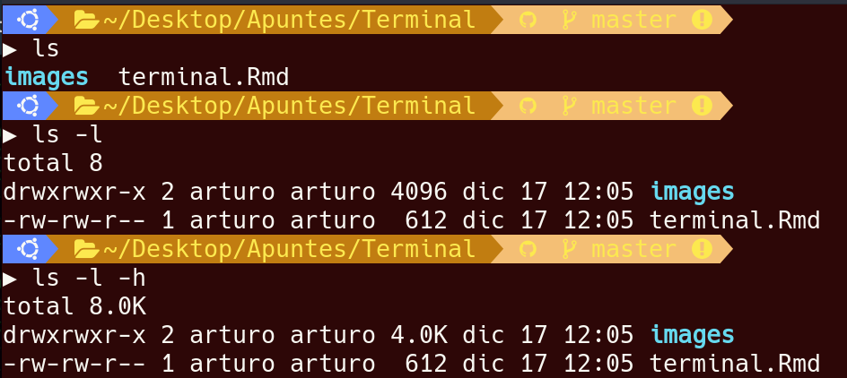
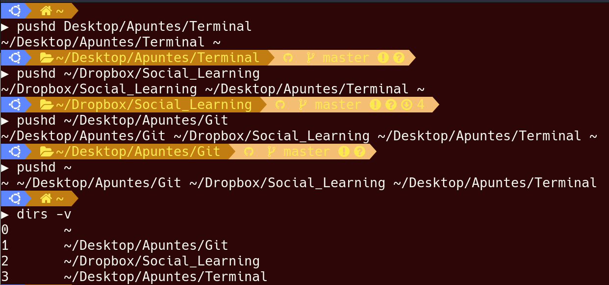
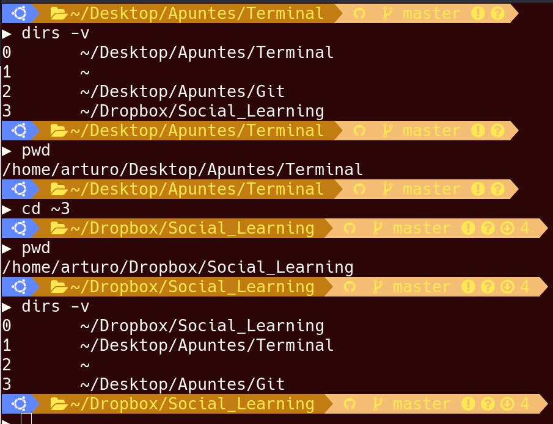
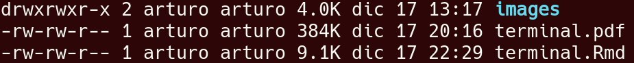
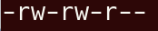
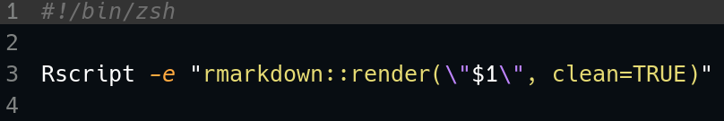

# Manual {#man}

+ **man** [comando] : muestra el manual del comando.
    - **Enter** : avanza una linea
    - **space** : avanza una pagina
    - **b** : retorcede una pagina

## Herramientas básicas {#basicas}

+ **open_command** [archivo] : abrir archivo con el programa por defecto.

+ **more** [archivo] : nos permite paginar un archivo, nos desplazamos con space una pagina y con enter una linea.

+ **cat** [archivo] : concatena e imprime todo el archivo

+ [comando|programa] **>** [archivo] : guarda la salida del comando o programa en el archivo dado sobreescribiendolo o creandolo.

+ [comando|programa] **>>** [archivo] : guarda la salida del comando o programa en el archivo dado, agregandolo a lo que ya contenga el archivo.

+ [comando|programa] **<** [archivo] : el contenido del archivo es la entrada del comando o programa.

+ **Ctrl+c** : termina el proceso.

+ **tail** [archivo] : muestra las ultimas lineas del archivo.
    - **-#** : define el numero de lineas que enseñara.
    - **-f** : la salida se recresca si el archivo tiene cambios.

+ **wc** : muestra la cuenta de los saltos de linea, palabras y bytes.
    - **-l** : cuenta lineas.

# Arbol de directorios {#directorios}

## Navegación {#nav}

+ **.** : simboliza al directorio **actual**.

+ **..** : simboliza al directorio **padre**.

+ **/** : simboliza al directorio **raiz**.

+ **~** : simboliza al directorio **HOME**.

+ **`*`** : comodin, lo que sea.

+ **ls** : listar archivos y directorios
    - **-l** : listar hacia abajo y ademas mostrar información extra de los archivos, permisos, owner, tamaño, ultima modificación y nombre.
    - **-h** : mostrar la información de una manera mas legible
    - **-a** : mostrar archivos ocultos.

```{r ls, out.width='75%', fig.align='center', fig.cap='comando ls y sus banderas', fig.pos='H', echo=FALSE}

```
+ **pwd** : nos muestra el "Working directory" el directorio en el que estamos actualmente.

+ **cd** [ruta]: change directory nos permite navegar entre los directorios. Acepta tanto rutas absolutas como relativas. Si no se le pasa ninguna ruta lleva a **HOME**

+ **clear** : limpia la terminal, se puede ejecutar con **Ctrl+l**.

## Manipular {#maipular}

+ **mkdir** [nombre] : crea el directorio.

+ **touch** [nombre] : crea un archivo y si ya existe modifica su fecha de creación.

+ **mv** [archvivo|directorio] [ruta/nombre_nuevo] : mueve el archivo a la ruta dada y lo renombra. Si solo se da el nombre nuevo sirve para renombrar el archivo.

+ **rm** [archvivo|directorio] : elimina el archivo.
    - **-r** : borrar de manera recursiva, es decir directorios.
    - **-f** : fuerza la operación.

+ **cp** [archivo|directorio] [ruta] : copia el archivo a la ruta dada.

### Pila de  directorios {#pila}
  
+ **pushd** [directorio] : ingresar el directorio actual a la pila y moverse al directorio dado.

+ **popd** [directorio] : sacar un directorio de la pila y moverse al directorio.

+ **dirs** : vizualizar la pila de directorios.
    - **-v** : vizualizar con una numeración.
    - **-c** : borrar la pila de directorios.

Ejemplo: supongamos que tenemos que estar constantemente moviendonos entre directorios que estan en rutas "distantes" podemos hacer lo siguiente.

```{r pila, out.width='75%', fig.align='center', fig.cap='agregando los directorios a la pila', fig.pos='H', echo=FALSE}

```
\newpage
Una vez que los directorios estan agregados en la pila podemos navegar a ellos utilizando los numeros como alias.

```{r alias, out.width='75%', fig.align='center', fig.cap='navegando con alias', fig.pos='H', echo=FALSE}

```

Cabe recalcar que la pila y por lo mismo los alias se van modificando según como naveguemos. Siempre siendo el 0 el directorio actual.

### Links Simbolicos {#links}

+ **ln -s** [archivo objetivo] [link] : genera el archivo link que es una link simbolico que apunta al archivo objetivo, es decir que si lo eliminamos no se eliminará el archivo al que apunta.
    - para borrar basta con rm

# Variables y Entorno {#variables}

+ **which** [comando] : nos dice en donde esta el ejecutable del comando.

+ **echo** [$variable] : imprime el contenido de la variable.

Para correr un ejecutable debe estar en la variable PATH.

+ **alias** [trigger] ['comandos'] : encapsula el comando o comandos con sus banderas en un mismo disparador. Digamos que crea un nuevo comando.

# Streams {#streams}

Todo programa hace uso de streams, tienen flujos de entrada y de salida. Los 3 streams mas importantes son los standard input, standard output y el standard error.

+ **standard input** : ingreso de datos.

+ **standard output** : salida de datos, todo lo que si deberia de pasar.

+ **standard error** : notificación de errores, lo que no deberia de pasar.

En la terminal la salida es la variable 1 y el error es la varibale 2 podemos mandar estas variables a otros lugares ademas de la pantalla. Para enviarlos al mismo lugar seria usando apuntadores 2>&1 y asi decimos que mande la variable 2 al mismo lugar que manda la variable 1.

# Procesos {#procesos}

Todo lo que se ejecute en la computadora es un proceso.

+ **top** : lista todos los procesos que estan corriendo en ese momento. Nos da información como el identificador del proceso, el nombre, la memoria que esta gastando, el porcentaje del CPU que esta ocupando, entre otras cosas.

+ **kill** [PID] : mata la proceso.
 - **-9** : mata sin preguntar y sin importar lo que este haciendo el proceso.

+ [comando|programa] **&** : corre el proceso en el background. y nos regresa el PID del proceso para tener cierto control.

+ [comando|programa 1] **;** [comando|programa 2] : primero se ejecuta el programa 1 y hasta que este termine incia el 2. Se pueden secuenciar n procesos todos con un **;** intermedio.

+ [comando|programa 1] **&** [comando|programa 2] : el comando 1 y el comando 2 se ejecutan de una manera completamente independiente.


+ **ps -wS** : lista todos los procesos que se estan ejecutando en el momento.

## Pipe (**|**) {#pipe}

Concatena comandos, es decir el standard output del primer comando lo manda como standard input del segundo.

+ [comando|programa 1] **|** [comando|programa 2] : concatena los comandos.


# Power Tools {#power}

## Busqueda {#search}

+ **grep** [archivo]: busca en el archivo las ocurrencias de una regex.
    - **-e** [regex] : definir la regex.
    - **-r** [directorio] : buscar en los archivos dentro de los directorios.
    - **-n** : nos permite ver el numero de linea donde encontro la regex.
    - **-v** [regex] : no imprime esa regex.
    - **-i** [regex] : busqueda no sensible a mayusculas.

+ **find** [directorio de inicio] : busca en la metadata de los archivos, no dentro de ellos a diferencia de **grep**.
    - **-name** ["cadena"] : busca en el nombre de archivo la cadena.
    - **-type** [tipo] : f es archivos, d directorio, entre otras opciones.

+ **du** : disk usage nos dice cuanta memoria ocupa cada nodo hoja directorio actual
    - **-h** : human readable.
    - **-d** [#]: niveles de recursividad.

## Variadas {#variadas}

+ **curl** [URL]: comando que emula un browser y nos regresa la respuesta de la URL.
    - **-o** [archivo] : crea o sobreescribe el archivo con lo que se obtuvo de la URL.

+ **zip** [nombre del archivo].zip [archivos] : comprime los archivos dados en un archivo.zip.

+ **unzip** [archivo.zip] : descomprime el archivo .zip
    - **-vl** : enlista el contenido del zip con información extra.

+ **tar cfz** [nombre del archivo].tar.gz [archivos]: comprime los archivos a un tar.gz utiliza zip como algoritmo de compresión.

+ **tar xfz** [archivo.tar.gz]: descomprime el archivo tar.gz.

+ **awk** '{codigo a ejecutar}': aplicar codigo en C al flujo de entrada.
    - **-F**["cadena"] : split por la cadena.

## Crontab (Automatizando tareas) {#crontab}

+ crontab **-l** : lista las tareas que tenemos programadas/instaladas.  

\begin{center}
\captionof{table}{Formato de salida de crontab -l}
\begin{tabular}{|c|c|c|c|c|c|}
\hline
Minuto -> 0-59 & Hora -> 0-23 & Dia-Mes -> 1-31 & Mes -> 1-12 & Dia-Semana -> 0-7 & Ejecutable -> ruta \\
\hline
\end{tabular}
\label{crontab-l}
\end{center}

+ crontab **-l** : lista las tareas que tenemos programadas/instaladas.
+ crontab **-e** : edita o crea el archivo de crontab que basta con llenar 6 columans para automatizar una tarea.  

El formato de los valores de las primeras 5 columanas no aceptan espacios y son los siguientes:

\begin{center}
\captionof{table}{Formatos de entra validos}
\begin{tabular}{|c|c|c|}
\hline
Nombre & Formato & Significado \\
\hline
\hline
Unico & 1 & Solo se ejecutara cuando el valor sea exactamente 1.\\
Multiples & 1,13,34 & Se ejecutará cunado el valor sea 1, 13 o 34.\\
Multiplos & `*`/5 & Se ejecutara en las horas multiplos de 5, cada 5 horas.\\
Rango & 1-7 & Se ejecutara de la hora 1 a la 7\\
Comodin & `*` & Se ejecutara en cada valor\\
\hline
\end{tabular}
\label{formatos}
\end{center}

# Usuarios y Permisos {#users}

+ **whoami** : regresa el usaurio con el qeu esta logeado.

Cuando se hace un ls -lh se imprime algo como lo siguiente:

\begin{center}
\captionof{table}{Encabezados del ls -lh}
\begin{tabular}{|c|c|c|c|}
\hline
Permisos & Usuario & Grupo & Información del archivo\\
\hline
\end{tabular}
\label{encabezados}
\end{center}


```{r permisos, out.width='75%', fig.align='center', fig.cap='Retorno del comando ls -lh', fig.pos='H', echo=FALSE}

```
Concentrandonos en lso permisos. Por ejemplo:

```{r ejemplo, out.width='75%', fig.align='center', fig.cap='ejemplo de permisos', fig.pos='H', echo=FALSE}

```
El primer caracter de los permisos nos dice:

\begin{center}
\captionof{table}{Tipos de ficheros}
\begin{tabular}{|c|c|}
\hline
Caracter & significado\\
\hline
\hline
- & archivo\\
d & directorio\\
l & link\\
\hline
\end{tabular}
\label{ficheros}
\end{center}

Los siguietes caracteres los agruparesmo de 3 en 3.
Cada grupo nos dira los permisos del:
1. dueño.
2. grupo.
3. quien sea.
\newpage
Los permisos se leén de la siguiente mandera:

\begin{center}
\captionof{table}{Nomenclatura de los permisos}
\begin{tabular}{|c|c|c|c|}
\hline
Numero & Binario & Caracteres & Permisos\\
\hline
\hline
0 & 000 & --- & ninguno\\
1 & 001 & --x & Ejecutar\\
2 & 010 & -w- & Escribir\\
3 & 011 & -wx & Ejecutar y Escribir\\
4 & 100 & r-- & Leer\\
5 & 101 & r-x & Ejecutar y Leer\\
6 & 110 & rw- & Leer y Escribir\\
7 & 111 & rwx & Ejecutar, Leer y Escribir\\
\hline
\end{tabular}
\label{nomenclatura}
\end{center}

## Cambiar permisos {#chmod}

+ **chmod** [dueño][grupo][quien sea] : chmod recibe un numero de 3 cifras cada cifra es el permiso correspondiente al dueño, grupo o quien sea segun la tabla de \hyperref[nomenclatura]{nomenclatura}.

# Scripts {#scripts}

Cuando se agrega un #! en la primera linea esto no es un comentario sino que son instrucciones para la ejecución de ese archivo.

```{r script, out.width='75%', fig.align='center', fig.cap='Ejemplo de script', fig.pos='H', echo=FALSE}

```